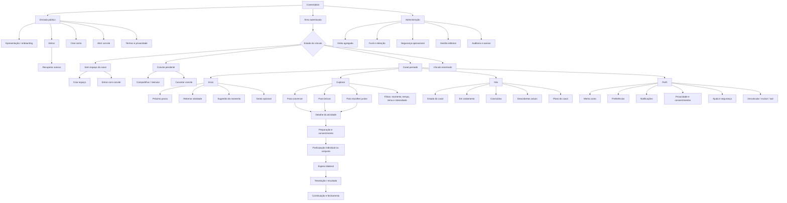

# Arquitetura de informação — Conectadois

**Versão:** 1.0 — 4 de setembro de 2026  
**Status:** arquitetura de referência para o MVP  
**Base:** PRD, escopo do MVP, priorização MoSCoW e jornada completa do casal.

## 1. Objetivo

Organizar conteúdos, funcionalidades, estados e caminhos do Conectadois para que duas pessoas consigam sair do convite e chegar à primeira descoberta com baixa fricção, sem perder autonomia individual, privacidade ou contexto.

A arquitetura é **mobile-first, bilateral e orientada ao momento**. A pessoa não precisa conhecer o catálogo inteiro para começar: a home indica o próximo passo mais relevante para o estado atual do casal.

## 2. Princípios de organização

1. **Próximo passo antes do catálogo:** a home prioriza uma ação principal contextual.
2. **Casal como unidade de valor; conta como unidade de controle:** experiências pertencem ao espaço do casal, enquanto autenticação, consentimento e saída pertencem a cada pessoa.
3. **Conteúdo por intenção, não por teoria:** usar rótulos como conversar, brincar e escolher juntos; evitar linguagem clínica.
4. **Estado bilateral sempre visível:** deixar claro quando falta minha ação, a ação da outra pessoa ou quando a revelação está pronta.
5. **Profundidade previsível:** tema, intensidade, duração e modo de participação aparecem antes de começar.
6. **Segurança no mesmo nível da experiência:** pular, pausar, ajuda, notificações e saída não ficam escondidos nem dependem de Premium.
7. **Administração isolada:** métricas e operação editorial não compartilham a navegação nem expõem respostas íntimas.

## 3. Modelo mental

O produto combina três espaços percebidos:

| Espaço | Pergunta que responde | Conteúdo principal |
|---|---|---|
| **Eu** | “O que depende de mim?” | conta, resposta individual, consentimento e preferências pessoais |
| **Nós** | “O que construímos juntos?” | vínculo, estado da dupla, revelações liberadas, progresso e histórico consentido |
| **Agora** | “O que podemos fazer neste momento?” | sugestão principal, retomada e exploração por ocasião |

Esses espaços não precisam virar três menus literais. Eles orientam linguagem, permissões e hierarquia.

## 4. Mapa geral



## 5. Navegação principal autenticada

| Destino | Papel | Conteúdo de primeiro nível | Regra |
|---|---|---|---|
| **Início** | orientar | ação principal, retomada, sugestão e gesto | conteúdo muda conforme estado do casal |
| **Explorar** | descobrir | categorias, trilhas e filtros | não exibir excesso de opções na primeira visita |
| **Nós** | acompanhar | sessões, descobertas consentidas e plano | nunca exibir resposta ainda selada |
| **Perfil** | controlar | conta, preferências, privacidade, ajuda e saída | configurações individuais claramente separadas das compartilhadas |

### Navegação persistente

- Barra inferior com quatro destinos: **Início**, **Explorar**, **Nós** e **Perfil**.
- Marca no cabeçalho retorna ao Início.
- Voltar preserva o estado da atividade sempre que for seguro.
- Administração aparece somente para papel autorizado e fora da barra inferior.
- Durante uma atividade imersiva, a barra pode ser ocultada; deve existir **Sair e continuar depois**.

## 6. Arquitetura por área

### 6.1 Entrada pública

1. **Apresentação:** promessa, funcionamento em três passos, duração, privacidade e gratuidade inicial.
2. **Onboarding:** diversão → descoberta → segurança; no máximo três telas antes da ação.
3. **Autenticação:** entrar, criar conta e recuperar acesso.
4. **Convite recebido:** contexto antes do cadastro, nome de quem convidou, benefício e aceite livre.
5. **Documentos:** termos, privacidade e canal de direitos acessíveis sem autenticação.

### 6.2 Início

A home funciona como roteador de estado, não como painel genérico.

Prioridade dos módulos:

1. alerta crítico de conta ou segurança;
2. revelação pronta;
3. minha participação pendente;
4. atividade em andamento aguardando a outra pessoa;
5. pareamento ou convite pendente;
6. sugestão principal do momento;
7. continuar explorando;
8. gesto opcional.

Estados obrigatórios:

| Estado | Mensagem principal | Ação primária |
|---|---|---|
| sem vínculo | criar ou entrar no espaço | Criar nosso espaço / Tenho um convite |
| aguardando convidada | convite enviado sem pressão | Compartilhar novamente |
| recém-pareado | espaço pronto | Fazer primeira atividade |
| minha vez | existe uma participação pendente | Responder agora |
| vez da outra pessoa | sua parte está segura | Acompanhar status |
| revelação pronta | as duas concluíram | Ver juntos |
| sem atividade ativa | sugestão contextual | Começar experiência |
| retorno após pausa | acolhimento sem culpa | Escolher para hoje |
| erro recuperável | explicar o que ocorreu | Tentar novamente |

### 6.3 Explorar

Estrutura primária por intenção:

- **Conversar:** perguntas guiadas e respostas seladas.
- **Brincar:** adivinhação e jogos leves.
- **Escolher juntos:** decisões, planos e pequenos combinados.

Metadados visíveis antes da abertura:

- duração estimada;
- intensidade: leve, média ou profunda;
- modo: individual assíncrono ou juntos;
- tema;
- indicação gratuita ou Premium;
- aviso de conteúdo quando aplicável.

Filtros prioritários: “temos 5 minutos”, “queremos rir”, “queremos conversar”, “estamos à distância” e “algo mais profundo”. Busca textual não é necessária no piloto; ganha valor quando o catálogo crescer.

### 6.4 Atividade

Toda atividade segue a mesma anatomia informacional:

1. **Detalhe:** título, convite, objetivo, tempo, tema, intensidade e modo.
2. **Preparação:** instrução curta, privacidade e consentimento quando necessário.
3. **Participação:** estímulo e ação atual, sem revelar conteúdo da outra pessoa.
4. **Espera:** confirmação da minha parte e estado neutro da dupla.
5. **Revelação ou resultado:** comparação sem julgamento ou diagnóstico.
6. **Continuação:** pergunta, conversa, gesto ou ação opcional.
7. **Fechamento:** concluir, avaliar conforto e escolher próximo passo.

Controles persistentes: pular, sair e continuar depois, reportar desconforto e ajuda contextual.

### 6.5 Nós

No piloto:

- situação do vínculo e integrantes;
- atividades em andamento;
- histórico mínimo de sessões concluídas;
- código do casal enquanto aplicável;
- gestão básica do plano quando existir teste comercial.

No MVP comercial:

- descobertas que ambas escolheram preservar;
- favoritos e atividades para depois;
- histórico completo Premium;
- gestão da assinatura única do casal.

Não mostrar na área compartilhada: rascunhos individuais, respostas seladas, preferências privadas, motivo de pulo ou de recusa e dados de segurança da outra pessoa.

### 6.6 Perfil

Agrupamento recomendado:

- **Minha conta:** nome, e-mail, senha, sessões e sair da conta.
- **Nossa conexão:** pessoa vinculada, data opcional, desvinculação e regra do histórico.
- **Experiência:** temas de interesse, temas a evitar, duração e profundidade.
- **Notificações:** frequência, horário, prévia oculta e silenciar.
- **Privacidade:** consentimentos, política, exportação aplicável e exclusão.
- **Ajuda e segurança:** suporte, denúncia de desconforto, acesso indevido e orientações de crise.
- **Plano:** condição, benefícios, renovação e cancelamento, quando aplicável.

### 6.7 Administração

Arquitetura isolada por papel:

- **Visão geral:** North Star, aquisição, ativação, engajamento e guardrails.
- **Funil bilateral:** visita → cadastro → convite → pareamento → primeira experiência → revelação → D7.
- **Conteúdo:** criar, revisar, versionar, publicar, retirar e consultar rastreabilidade.
- **Segurança:** incidentes agregados, falhas de autorização e operação de suporte.
- **Acesso e auditoria:** papéis, MFA, registro de ações e princípio do menor privilégio.

Nenhuma área administrativa pode acessar texto de respostas íntimas.

## 7. Inventário de telas

| ID | Tela | Área | Piloto | Estado/observação |
|---|---|---|---|---|
| PUB-01 | Apresentação/onboarding | pública | sim | visitante |
| AUT-01 | Entrar | pública | sim | erro, carregando, sucesso |
| AUT-02 | Criar conta | pública | sim | validação e consentimento |
| AUT-03 | Recuperar acesso | pública | sim | envio e confirmação |
| PAR-01 | Criar espaço | conexão | sim | pessoa sem vínculo |
| PAR-02 | Convite gerado | conexão | sim | compartilhar, copiar, cancelar |
| PAR-03 | Convite recebido | pública | sim | pré-cadastro e aceite |
| PAR-04 | Entrar com código | conexão | sim | válido, inválido, expirado, usado |
| PAR-05 | Pareamento confirmado | conexão | sim | primeiro valor em seguida |
| HOM-01 | Início contextual | Início | sim | estados descritos na seção 6.2 |
| EXP-01 | Explorar | Explorar | sim | categorias e filtros mínimos |
| EXP-02 | Detalhe da atividade | Explorar | sim | metadados e consentimento |
| ATV-01 | Participação | atividade | sim | mecânica dependente do formato |
| ATV-02 | Espera | atividade | sim | conteúdo selado |
| ATV-03 | Revelação/resultado | atividade | sim | liberação bilateral |
| ATV-04 | Continuação/fechamento | atividade | sim | gesto e feedback opcional |
| NOS-01 | Nosso espaço | Nós | sim | vínculo e estados ativos |
| NOS-02 | Histórico mínimo | Nós | sim | sessões, sem respostas na home |
| NOS-03 | Descobertas salvas | Nós | comercial | somente consentidas |
| PER-01 | Perfil e preferências | Perfil | sim | individual + compartilhado separados |
| PER-02 | Notificações | Perfil | sim | neutras e silenciáveis |
| PER-03 | Privacidade e consentimentos | Perfil | sim | direitos acessíveis |
| PER-04 | Ajuda e segurança | Perfil | sim | suporte sem pedir conteúdo íntimo |
| PER-05 | Desvincular | Perfil | sim | confirmação e destino dos dados |
| PER-06 | Excluir conta | Perfil | sim | autenticação reforçada e prazo |
| PLN-01 | Plano e assinatura | Perfil/Nós | comercial | uma assinatura por casal |
| ADM-01 | Dashboard agregado | administração | sim | somente admin |
| ADM-02 | Gestão editorial | administração | sim | papéis editoriais |
| ADM-03 | Auditoria e segurança | administração | comercial | sem respostas íntimas |

## 8. Objetos de informação

| Objeto | Pertence a | Relações essenciais | Sensibilidade |
|---|---|---|---|
| usuário | pessoa | conta, vínculo, preferências e consentimentos | alta |
| casal | dupla | exatamente dois usuários ativos | alta |
| convite | casal/iniciadora | código, validade, estado e uso | média/alta |
| atividade | catálogo | formato, tema, intensidade, duração e versão | baixa |
| sessão | casal | atividade, estados individuais e fechamento | alta |
| resposta | pessoa + sessão | permanece privada até regra de revelação | crítica |
| revelação | sessão | existe somente após condição bilateral | crítica |
| preferência | pessoa ou casal | escopo explícito e precedência definida | alta |
| descoberta salva | casal | exige escolha explícita de preservação | crítica |
| assinatura | casal | pagador, entitlement, renovação e cancelamento | alta |
| evento analítico | operação | sem conteúdo íntimo; identificadores minimizados | média |
| atividade editorial | operação | autoria, evidência, revisão, risco e versão | interna |

## 9. Regras de acesso e visibilidade

| Informação/ação | Pessoa atual | Pessoa parceira | Administração |
|---|---:|---:|---:|
| meus dados de conta | ler/editar | não | suporte restrito e auditado |
| vínculo e estado da dupla | ler | ler | agregado ou suporte autorizado |
| minha resposta antes da revelação | ler/editar conforme regra | não | não |
| resposta parceira antes da revelação | não | — | não |
| respostas após revelação | ler | ler | não |
| motivo individual de pulo/recusa | ler se registrado | não | somente agregado |
| preferências individuais | ler/editar | não, salvo escolha explícita | não |
| preferências compartilhadas | ler/editar conforme regra bilateral | ler/editar conforme regra bilateral | agregado |
| desvincular minha conta | executar | não aprova | suporte não bloqueia |
| excluir minha conta | executar com confirmação | não aprova | processa sem ler conteúdo |
| métricas do produto | não | não | agregado por papel |

## 10. Vocabulário de interface

| Usar | Evitar | Motivo |
|---|---|---|
| espaço de vocês | perfil do casal | reforça acolhimento sem fundir identidades |
| experiência / momento | exercício / sessão terapêutica | mantém caráter leve |
| revelação | resultado correto | evita competição |
| sua vez / aguardando | parceiro atrasado | estado neutro sem cobrança |
| pular por agora | recusar pergunta | reduz culpa |
| Nós | relacionamento | rótulo curto, inclusivo e afetivo |
| sair do espaço | terminar relacionamento | descreve ação do produto sem inferência |

## 11. Rotas conceituais

As rotas finais dependem da arquitetura técnica, mas devem preservar URLs estáveis e compreensíveis:

```text
/
/entrar
/criar-conta
/recuperar-acesso
/convite/:codigo
/conectar
/inicio
/explorar
/explorar/:categoria
/atividade/:id
/sessao/:id/participar
/sessao/:id/aguardar
/sessao/:id/revelar
/nos
/nos/historico
/perfil
/perfil/preferencias
/perfil/notificacoes
/perfil/privacidade
/perfil/ajuda
/perfil/conexao
/perfil/plano
/admin
/admin/conteudo
/admin/seguranca
```

Links profundos exigem autenticação quando necessário e devem retornar ao destino original depois do login, sem revelar no URL qualquer conteúdo íntimo.

## 12. Escopo por versão

| Camada | Piloto | MVP comercial | Pós-MVP |
|---|---|---|---|
| entrada e pareamento | completo | otimizado e medido | novos canais |
| home contextual | estados críticos | personalização ampliada | recomendações avançadas |
| explorar | categorias e filtros mínimos | trilhas, favoritos e Premium | ocasiões e coleções avançadas |
| atividade | três mecânicas | catálogo ampliado | novos formatos |
| Nós | vínculo, andamento e histórico mínimo | descobertas e histórico completo | memórias e retrospectivas |
| Perfil | conta, preferências, segurança e saída | plano e direitos completos | controles adicionais |
| Administração | métricas agregadas e editorial mínimo | auditoria e operação comercial | análises avançadas |

## 13. Critérios de aceite

- qualquer tela autenticada permite identificar área atual e caminho de retorno;
- a home representa corretamente os estados sem vínculo, convite pendente, minha vez, espera e revelação pronta;
- a pessoa convidada entende proposta e privacidade antes de criar conta;
- nenhuma resposta selada aparece em navegação, URL, notificação, log ou administração;
- tema, intensidade, duração e modo aparecem antes de iniciar uma atividade;
- pular, pausar, ajuda, desvinculação e exclusão são encontráveis sem busca;
- configurações individuais e compartilhadas são visualmente distinguíveis;
- a navegação funciona por teclado, leitor de tela e viewport móvel;
- rotas protegidas restauram contexto depois da autenticação;
- estados vazio, carregando, erro, offline e sucesso estão definidos nos fluxos críticos;
- analytics mede o funil bilateral sem registrar respostas íntimas.

## 14. Validação recomendada

Validar a arquitetura com card sorting moderado e teste de árvore antes do refinamento visual. Tarefas mínimas: aceitar convite, encontrar atividade de cinco minutos, entender quem precisa responder, localizar uma revelação pronta, silenciar notificações, pular tema desconfortável, pedir ajuda e sair do espaço. Testar separadamente pessoa iniciadora e convidada.

## 15. Decisões e pendências

### Decidido

- quatro destinos principais: Início, Explorar, Nós e Perfil;
- home orientada pelo estado do casal;
- Administração isolada;
- conteúdo classificado primeiro por intenção e depois por tema/intensidade;
- respostas individuais nunca integram navegação ou busca compartilhada antes da revelação.

### Pendente de validação

- compreensão do rótulo **Nós** versus **Nosso espaço**;
- preferência por explorar via intenção, ocasião ou formato;
- necessidade real de busca textual no primeiro catálogo;
- entendimento de preferências individuais versus compartilhadas;
- melhor localização para plano e assinatura: Nós, Perfil ou ambos com uma fonte única.
