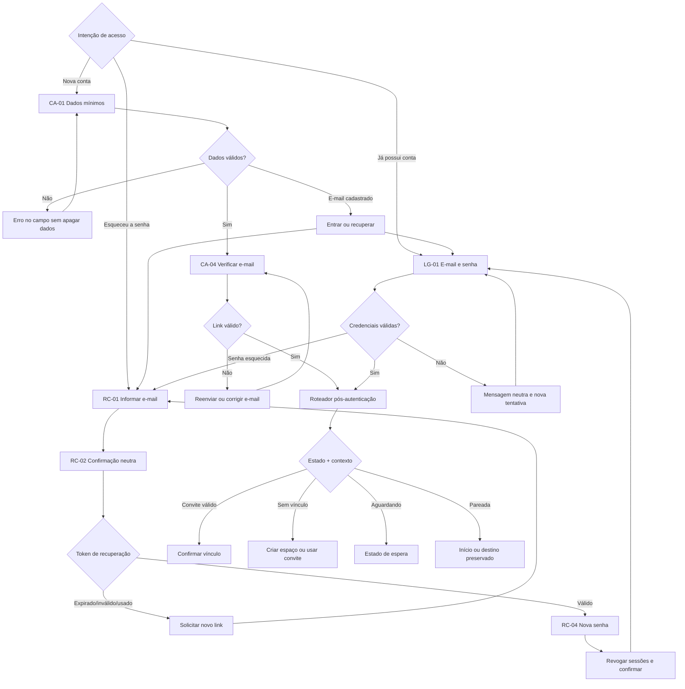

# Fluxo de cadastro, login e recuperação — Conectadois

**Versão:** 1.0 — 4 de setembro de 2026  
**Status:** desenho funcional pronto para prototipação; validação com usuários pendente  
**Dependências:** arquitetura de informação e fluxo de onboarding  
**Escopo:** conta individual, autenticação, verificação de e-mail, recuperação de senha e continuidade de contexto.

## 1. Objetivo

Permitir que uma pessoa crie ou recupere seu acesso com baixo esforço e entenda que sua conta é individual, mesmo quando participa de um espaço compartilhado com o casal.

O sistema deve:

- pedir apenas os dados necessários para criar a conta;
- preservar convite e destino original durante toda a autenticação;
- explicar erros no campo correto sem apagar informações válidas;
- evitar revelar se um e-mail possui conta nos fluxos públicos sensíveis;
- permitir verificação, recuperação e troca de senha com links temporários;
- rotear a pessoa pelo estado real da conta depois da autenticação.

## 2. Princípios

1. **Uma conta por pessoa:** nunca criar credencial compartilhada para o casal.
2. **Contexto preservado:** onboarding, convite e link profundo sobrevivem à troca entre cadastro, login e recuperação.
3. **Erro acionável:** dizer o que pode ser corrigido sem expor informação útil a atacantes.
4. **Segurança sem susto:** comunicar proteção em linguagem simples, sem jargão técnico.
5. **Sem becos sem saída:** toda confirmação oferece um próximo passo e toda falha recuperável oferece ação.
6. **Progressive disclosure:** regras aparecem perto do campo relevante; textos legais completos ficam acessíveis por link.
7. **Privacidade por padrão:** analytics não recebe e-mail, nome, senha, token ou código bruto de convite.

## 3. Mapa de rotas conceituais

| Rota | Tela | Acesso | Próximo destino |
|---|---|---|---|
| `/criar-conta` | cadastro | público | verificar e-mail ou roteamento autenticado |
| `/entrar` | login | público | destino preservado ou roteamento por estado |
| `/recuperar-acesso` | solicitar recuperação | público | confirmação neutra |
| `/redefinir-senha?token=…` | nova senha | link temporário | confirmação → login |
| `/verificar-email?token=…` | verificação | link temporário | confirmação → destino preservado |
| `/reenviar-verificacao` | reenvio | sessão limitada ou dado assinado | confirmação neutra |

Parâmetros de retorno devem usar identificadores internos ou destinos permitidos. Nunca incluir resposta íntima, nome da pessoa parceira, senha ou token de sessão em URL.

## 4. Roteamento de entrada e saída

### Contextos de entrada

- onboarding concluído ou pulado → cadastro;
- “Já tenho uma conta” → login;
- convite aceito → cadastro ou login com convite preservado;
- sessão expirada → login com destino original preservado;
- link de recuperação → validação do token antes de mostrar nova senha;
- link de verificação → validação do token e retorno ao fluxo anterior.

### Roteador pós-autenticação

| Estado da conta | Contexto preservado | Destino |
|---|---|---|
| não verificada | qualquer | aviso de verificação, com reenvio e troca de e-mail |
| verificada, convite válido | convite | confirmar vínculo |
| verificada, sem vínculo | nenhum | criar espaço ou usar convite |
| verificada, convite próprio/incompatível | convite | erro explicado sem consumir convite |
| verificada, aguardando parceira | qualquer | estado de espera e compartilhamento |
| verificada, casal pareado | link profundo permitido | destino original ou Início |
| sessão administrativa autorizada | `/admin` | painel administrativo |

## 5. Fluxo de cadastro

### CA-01 — Criar conta

**Título:** “Crie seu acesso individual.”  
**Apoio:** “Depois, você pode criar ou entrar no espaço de vocês.”

**Campos:**

1. **Como podemos chamar você?** — nome de exibição, 2 a 60 caracteres; explicar que será visível para a pessoa parceira.
2. **Seu e-mail** — normalizar espaços e caixa; usar teclado e preenchimento automático adequados.
3. **Crie uma senha** — permitir mostrar/ocultar; não impedir colagem ou gerenciador de senhas.

**Regra recomendada para senha:** mínimo de 10 caracteres no produto final, aceitar espaços e até 128 caracteres; bloquear senhas sabidamente comprometidas no backend. Não exigir combinações arbitrárias de maiúscula, número e símbolo.

**Consentimentos:** aceite obrigatório de Termos e ciência da Política de Privacidade em linguagem clara; comunicações promocionais, se existirem, separadas e desmarcadas por padrão.

**Ação primária:** “Criar minha conta”.  
**Ação secundária:** “Já tenho uma conta”.  
**Contexto de convite:** banner discreto “Seu convite está guardado. Você voltará a ele depois de criar a conta.”

### CA-02 — Validação

- validar após saída do campo e novamente no envio;
- associar mensagem ao campo e levar foco ao primeiro erro;
- preservar todos os valores válidos;
- aceitar correção sem remover o contexto de retorno;
- durante envio, manter texto do botão e acrescentar estado “Criando conta…”;
- impedir envios duplicados sem bloquear navegação após erro.

### CA-03 — E-mail já cadastrado

Na tentativa de cadastro, é aceitável informar: “Já existe uma conta com este e-mail. Entre ou recupere seu acesso.” A resposta deve ter proteção contra abuso e enumeração em escala.

**Ações:** “Entrar” e “Recuperar acesso”; o e-mail e o contexto são preservados.

### CA-04 — Verificação de e-mail

**Título:** “Confira seu e-mail.”  
**Apoio:** “Enviamos um link para confirmar que este endereço é seu.”  
**Ações:** “Abrir meu e-mail”, “Reenviar” após contagem regressiva e “Corrigir endereço”.  
**Regra:** o link é de uso único, expira e fica inválido depois de troca do e-mail ou nova emissão quando a política exigir.

Se o MVP permitir entrada antes da verificação, ações sensíveis ficam limitadas e um aviso persistente explica como concluir. A decisão deve ser explícita na implementação.

## 6. Fluxo de login

### LG-01 — Entrar

**Título:** “Que bom ter você de volta.”  
**Campos:** e-mail e senha.  
**Controles:** mostrar/ocultar senha, “Esqueci minha senha”, preenchimento automático e aviso de convite preservado.  
**Ação primária:** “Entrar”.  
**Ação secundária:** “Quero criar uma conta”.

### LG-02 — Credenciais inválidas

Mensagem única: “E-mail ou senha incorretos.” Não confirmar qual parte falhou. Preservar e-mail, limpar apenas a senha quando necessário e manter convite/destino.

Depois de tentativas sucessivas, aplicar limitação progressiva no backend e mensagem com tempo de espera. Não usar desafio visual inacessível como primeira defesa.

### LG-03 — E-mail não verificado

Depois de credenciais corretas, exibir instrução de verificação com ações para reenviar ou corrigir o e-mail. Não misturar “não verificado” com “senha incorreta”.

### LG-04 — Sessão expirada ou revogada

**Mensagem:** “Sua sessão terminou para proteger sua conta. Entre novamente para continuar.”  
O login retorna ao destino permitido anterior. Rascunhos íntimos não devem ser colocados em URL nem enviados a analytics; preservação local depende da política de segurança do fluxo específico.

## 7. Fluxo de recuperação

### RC-01 — Solicitar link

**Título:** “Recupere seu acesso.”  
**Apoio:** “Informe seu e-mail e enviaremos um link para criar uma nova senha.”  
**Campo:** e-mail.  
**Ação primária:** “Enviar link”.  
**Ação secundária:** “Voltar para entrar”.

### RC-02 — Confirmação neutra

Usar a mesma resposta exista ou não uma conta: “Se houver uma conta com este e-mail, você receberá as instruções em alguns minutos.”

**Ações:** “Abrir meu e-mail”, “Reenviar” após intervalo e “Usar outro e-mail”. Incluir orientação para conferir spam e remetente oficial, sem pedir que a pessoa responda ao e-mail.

### RC-03 — Abrir link

O backend valida uso, expiração e finalidade do token antes da troca.

| Estado | Resposta |
|---|---|
| válido | mostrar formulário de nova senha |
| expirado | explicar expiração e oferecer novo link |
| já utilizado | informar que não pode ser reutilizado e oferecer login ou novo link |
| inválido/malformado | mensagem genérica e novo pedido |

### RC-04 — Criar nova senha

**Campos:** nova senha e confirmação.  
**Ação:** “Salvar nova senha”.  
Aplicar a mesma política do cadastro, mostrar requisitos antes do envio e permitir mostrar/ocultar ambos os campos.

Ao concluir:

- invalidar o token de recuperação;
- revogar sessões existentes, com opção futura de manter o dispositivo atual quando houver reautenticação forte;
- enviar aviso de segurança por e-mail;
- confirmar “Senha alterada com sucesso”;
- direcionar ao login com e-mail preenchido e contexto original preservado.

## 8. Fluxograma

Versão visual: `docs/FLUXO-DE-CADASTRO-LOGIN-E-RECUPERACAO.svg`.

## 9. Mensagens e validações

| Situação | Mensagem recomendada | Comportamento |
|---|---|---|
| nome ausente | “Diga como podemos chamar você.” | foco no nome |
| e-mail malformado | “Confira o formato do e-mail.” | preservar valor |
| senha abaixo da regra | “Use pelo menos 10 caracteres.” | requisitos visíveis |
| confirmação diferente | “As senhas não coincidem.” | foco na confirmação |
| login inválido | “E-mail ou senha incorretos.” | não revelar cadastro |
| rede indisponível | “Sem conexão. Confira sua internet e tente novamente.” | manter formulário |
| servidor indisponível | “Não conseguimos concluir agora.” | tentar novamente |
| excesso de tentativas | “Muitas tentativas. Aguarde alguns minutos.” | informar espera |
| token expirado | “Este link expirou para proteger sua conta.” | solicitar outro |
| sessão expirada | “Sua sessão terminou para proteger sua conta.” | login e retorno |

Mensagens devem ser anunciadas por leitor de tela e não depender apenas de cor.

## 10. Requisitos de segurança e privacidade

- senha processada somente no backend com algoritmo lento e salt individual;
- conexão cifrada em produção;
- tokens de sessão, verificação e recuperação imprevisíveis, temporários e nunca registrados em logs;
- recuperação com resposta pública neutra, uso único e limitação por IP/conta;
- revogar sessões após troca de senha e permitir revogação pelo usuário;
- cookies `HttpOnly`, `Secure` e `SameSite` são preferíveis a token persistido em `localStorage` na versão de produção;
- proteção contra CSRF quando autenticação migrar para cookies;
- mensagens e tempo de resposta não devem facilitar enumeração de contas;
- não enviar senha, token, e-mail ou nome para analytics;
- consentimento promocional independente e revogável;
- acesso a Termos, Privacidade, Ajuda e direitos LGPD sem autenticação.

## 11. Acessibilidade

- um `label` programático por campo; placeholder não substitui rótulo;
- `autocomplete="name"`, `email`, `current-password` e `new-password` conforme o caso;
- teclado correto em mobile e botão de envio acessível pelo Enter;
- ordem de foco lógica; foco no primeiro erro após envio;
- resumo de erro no topo ligado aos campos quando houver múltiplos erros;
- botão mostrar senha anuncia estado “mostrar/ocultar”;
- alvo mínimo de 44 × 44 px;
- textos ampliáveis a 200%, contraste AA e estados de foco visíveis;
- contagem regressiva de reenvio não deve atualizar leitor de tela a cada segundo.

## 12. Instrumentação

| Evento | Momento | Propriedades permitidas |
|---|---|---|
| `signup_viewed` | cadastro exibido | `entry_type`, `has_invite`, `variant` |
| `signup_submitted` | envio iniciado | `entry_type`, `has_invite` |
| `signup_completed` | conta criada | `entry_type`, `has_invite` |
| `login_viewed` | login exibido | `entry_type`, `has_return_to` |
| `login_completed` | sessão criada | `entry_type`, `has_return_to` |
| `auth_error_shown` | falha apresentada | `flow`, `error_type`, `recoverable` |
| `verification_sent` | mensagem solicitada | `trigger`, `rate_limited` |
| `email_verified` | confirmação concluída | `link_age_bucket` |
| `password_reset_requested` | pedido aceito | `entry_type`, `rate_limited` |
| `password_reset_completed` | senha alterada | `link_age_bucket` |
| `session_expired` | sessão rejeitada | `destination_type` |

Métricas: conclusão por fluxo e origem, erros por campo/tipo, cadastro → verificação, recuperação solicitada → concluída e retorno correto ao convite/destino.

## 13. Critérios de aceite

- cadastro solicita apenas nome, e-mail, senha e consentimentos necessários;
- conta é descrita como individual em cadastro e confirmação;
- alternar cadastro/login preserva e-mail, convite e destino permitido;
- campos mantêm dados válidos após erro;
- login usa mensagem neutra para credenciais inválidas;
- recuperação não confirma publicamente se o e-mail existe;
- tokens de verificação e recuperação expiram, são de uso único e não aparecem em logs;
- troca de senha revoga sessões existentes;
- sessão expirada retorna ao destino permitido após novo login;
- os fluxos funcionam por teclado, leitor de tela e preenchimento automático;
- nenhum evento contém e-mail, nome, senha, token ou código bruto de convite.

## 14. Lacunas entre desenho e implementação atual

| Capacidade | Estado atual | Trabalho necessário |
|---|---|---|
| cadastro básico | implementado com nome, e-mail e senha | ajustar política, consentimentos e mensagens por campo |
| login básico | implementado | incluir mostrar senha, recuperação e retorno de contexto |
| verificação de e-mail | ausente | criar emissão, confirmação, expiração e reenvio |
| recuperação de senha | ausente | criar pedido neutro, token, troca e aviso de segurança |
| revogação de sessão | parcial por expiração | criar logout no backend e revogação após troca de senha |
| contexto de convite/link profundo | ausente | persistir estado seguro durante autenticação |
| proteção contra abuso | ausente | implementar rate limit e monitoramento sem dados sensíveis |
| armazenamento de sessão | `localStorage` | migrar para cookie seguro antes de produção |

## 15. Plano de validação

O fluxo permanece “Em andamento” até:

1. protótipo navegável mobile de cadastro, login, verificação e recuperação;
2. teste com pelo menos cinco participantes, incluindo duas pessoas que entrem por convite;
3. tarefas sem mediação: criar conta, corrigir erro, alternar para login, recuperar senha e retomar convite;
4. metas: ≥ 80% concluem cada tarefa sem ajuda; 100% compreendem que a conta é individual; 100% retomam o convite sem redigitar; nenhum participante perde dados válidos após erro;
5. revisão de segurança e privacidade antes da implementação produtiva.
