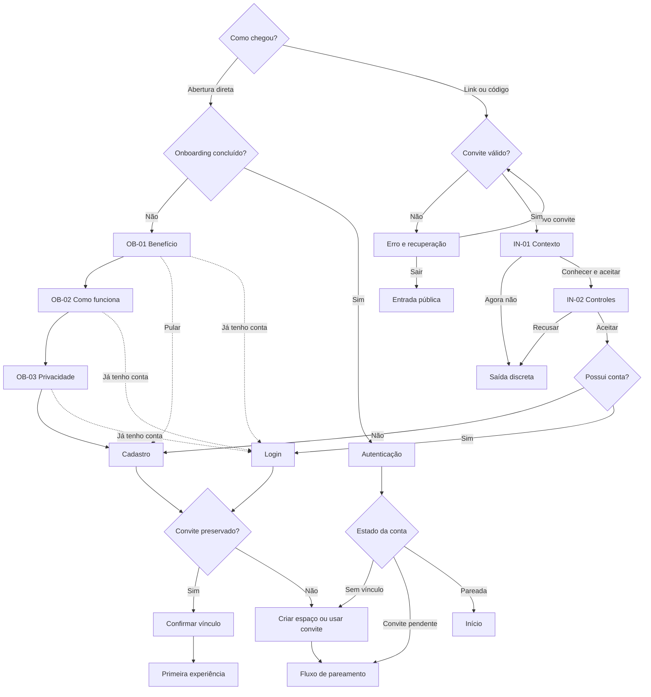

# Fluxo de onboarding — Conectadois

**Versão:** 1.0 — 4 de setembro de 2026  
**Status:** desenho funcional pronto para prototipação; validação com casais pendente  
**Escopo:** entrada pública anterior ao cadastro, com tratamento específico para acesso direto e convite recebido.

## 1. Objetivo

Levar cada pessoa ao próximo passo adequado em até três telas, explicando que o Conectadois é uma experiência leve para duas pessoas, que as contas são individuais e que respostas privadas só são reveladas quando ambas participam.

O onboarding deve reduzir duas dúvidas diferentes:

- **pessoa iniciadora:** “consigo convidar meu amor sem parecer uma cobrança?”;
- **pessoa convidada:** “posso entrar sem ser julgada, exposta ou obrigada a responder?”.

## 2. Resultado esperado

Ao concluir, a pessoa deve conseguir responder:

1. **Para que serve?** Para descobrir, conversar e criar momentos a dois.
2. **Como funciona?** Cada pessoa tem sua conta, o casal conecta os acessos e participa no próprio ritmo.
3. **Minhas respostas ficam protegidas?** Sim; nas experiências seladas, só aparecem depois da participação das duas pessoas.
4. **Qual é o próximo passo?** Criar conta, entrar em uma conta existente ou aceitar/recusar um convite.

O onboarding não promete melhorar, diagnosticar ou medir a qualidade do relacionamento.

## 3. Princípios de UX

- no máximo três telas explicativas antes da ação;
- uma ideia principal e uma ação primária por tela;
- “Pular apresentação” disponível desde a primeira tela;
- “Já tenho uma conta” persistente;
- progresso textual e visual: “1 de 3”, “2 de 3”, “3 de 3”;
- não pedir dados pessoais, permissões ou preferências durante a apresentação;
- não usar streak, pontuação, culpa ou urgência para estimular adesão;
- preservar o contexto do convite ao atravessar cadastro ou login;
- respeitar redução de movimento, leitor de tela, teclado e contraste AA;
- manter o estado local se a pessoa fechar e voltar, exceto em navegação privada.

## 4. Entradas e roteamento

| Entrada | Contexto conhecido | Destino inicial | Ação principal ao final |
|---|---|---|---|
| abertura direta, primeira visita | nenhum | apresentação 1 de 3 | Criar minha conta |
| abertura direta, apresentação já concluída | preferência local | autenticação | Criar conta ou entrar |
| botão “Já tenho uma conta” | intenção de login | login | Entrar |
| link/código de convite válido | convite e pessoa iniciadora | contexto do convite | Aceitar convite |
| convite expirado, usado ou inválido | erro verificável | recuperação do convite | Pedir novo convite / Digitar código |
| pessoa autenticada sem vínculo | conta individual | criar ou entrar em espaço | Criar espaço / Usar convite |
| pessoa autenticada já pareada | vínculo ativo | Início | Continuar no app |

## 5. Fluxo principal — descoberta direta

### OB-01 — Boas-vindas

**Objetivo:** comunicar benefício e público em até cinco segundos.  
**Título:** “Mais presença. Mais vocês.”  
**Apoio:** “Um espaço para casais descobrirem algo novo, conversarem e transformarem pequenos momentos em conexão de verdade.”  
**Prova curta:** “Feito para ser vivido a dois.”  
**Ação primária:** “Continuar”.  
**Ações secundárias:** “Pular apresentação” e “Já tenho uma conta”.

### OB-02 — Funcionamento

**Objetivo:** tornar a mecânica concreta e reduzir esforço percebido.  
**Título:** “Descubram no ritmo de vocês.”  
**Apoio:** “Escolham uma experiência de 3 a 10 minutos, participem quando puderem e abram juntos uma nova conversa.”  
**Representação:** três passos — escolher → participar → descobrir.  
**Prova curta:** “Experiências rápidas e significativas.”  
**Ação primária:** “Continuar”.  
**Ação secundária:** “Voltar”.

### OB-03 — Segurança e autonomia

**Objetivo:** estabelecer confiança antes do cadastro.  
**Título:** “Cada resposta no tempo de vocês.”  
**Apoio:** “Nas experiências privadas, uma resposta só é revelada quando as duas pessoas participam. Qualquer pessoa pode pular ou sair.”  
**Prova curta:** “Conta individual. Espaço compartilhado. Privacidade desde o início.”  
**Ação primária:** “Criar minha conta”.  
**Ações secundárias:** “Voltar” e “Já tenho uma conta”.

### Saída do fluxo

- “Criar minha conta” → cadastro individual, preservando `source=onboarding`;
- “Já tenho uma conta” → login;
- “Pular apresentação” → cadastro individual;
- autenticação concluída sem convite → escolha “Criar nosso espaço” ou “Tenho um convite”;
- autenticação concluída com convite preservado → confirmação do vínculo, sem exigir redigitação.

## 6. Fluxo alternativo — convite recebido

O convite não deve abrir na apresentação genérica. Primeiro, a pessoa precisa entender quem a convidou, o que acontecerá e quais controles terá.

### IN-01 — Contexto do convite

**Título:** “{Nome} convidou você para um espaço a dois.”  
**Apoio:** “Uma forma leve de vocês conversarem, brincarem e descobrirem algo novo em poucos minutos.”  
**Informações visíveis:** quem convidou; duração típica; conta individual; respostas seladas; uso gratuito inicial; validade do convite.  
**Ação primária:** “Conhecer e aceitar”.  
**Ações secundárias:** “Já tenho uma conta” e “Agora não”.

### IN-02 — Consentimento informado

**Título:** “Você continua no controle.”  
**Itens:** participar é opcional; é possível pular experiências; a outra pessoa não vê respostas seladas antes da liberação; é possível sair do espaço nas configurações.  
**Ação primária:** “Aceitar convite”.  
**Ação secundária:** “Recusar”.

### IN-03 — Autenticação com contexto preservado

- sem conta → cadastro individual → confirmação do casal;
- com conta → login → confirmação do casal;
- conta já vinculada → bloquear novo vínculo, explicar a situação e oferecer suporte/gestão do vínculo atual;
- convite para a própria conta → explicar o erro sem consumir o convite;
- recusa → confirmar discretamente e não solicitar motivo íntimo; a pessoa iniciadora recebe apenas o estado “convite não aceito”.

## 7. Fluxograma

Versão visual para compartilhamento: `docs/FLUXO-DE-ONBOARDING.svg`.

## 8. Estados e recuperação

| Estado | Mensagem | Ação segura |
|---|---|---|
| sem conexão ao avançar | “Não conseguimos carregar o próximo passo.” | Tentar novamente; conteúdo essencial continua legível |
| convite expirado | “Este convite não está mais disponível.” | Pedir novo convite ou digitar outro código |
| convite já usado | “Este convite já foi usado.” | Entrar na conta ou pedir ajuda |
| convite inválido | “Não encontramos este convite.” | Conferir código sem apagar o valor digitado |
| falha de autenticação | explicar o campo/causa quando seguro | corrigir e reenviar sem perder convite |
| sessão existente | não repetir onboarding | rotear pelo estado real da conta |
| armazenamento indisponível | apresentação pode reaparecer | nunca bloquear cadastro/login |

## 9. Acessibilidade e conteúdo

- títulos em ordem semântica, foco movido para o título ao trocar de etapa;
- botões de progresso com nome acessível e estado atual anunciado;
- alvo de toque mínimo de 44 × 44 px;
- ilustrações decorativas ignoradas por tecnologia assistiva;
- animação limitada a transição breve e removida com `prefers-reduced-motion`;
- nenhuma informação depende apenas de cor, ícone ou animação;
- texto ampliado até 200% sem perda de ação ou sobreposição;
- linguagem inclusiva: “pessoa”, “casal”, “vocês” e “seu amor”, sem assumir gênero ou configuração familiar;
- links de Termos, Privacidade e Ajuda acessíveis antes do cadastro.

## 10. Instrumentação mínima

Não registrar nomes, conteúdo de respostas, código completo do convite ou qualquer texto íntimo.

| Evento | Quando | Propriedades permitidas |
|---|---|---|
| `onboarding_started` | primeira tela exibida | `entry_type`, `variant` |
| `onboarding_step_viewed` | cada etapa visível | `step_id`, `position`, `variant` |
| `onboarding_skipped` | apresentação pulada | `from_step`, `entry_type` |
| `onboarding_completed` | CTA final acionado | `entry_type`, `variant` |
| `existing_account_selected` | login escolhido | `from_step`, `entry_type` |
| `invite_context_viewed` | convite válido exibido | `invite_age_bucket`, `channel` |
| `invite_accepted` | aceite explícito | `account_state`, `channel` |
| `invite_declined` | recusa explícita | `channel`; sem motivo |
| `onboarding_error_shown` | erro exibido | `error_type`, `recoverable` |

Indicadores: conclusão geral e por entrada, abandono por etapa, uso de “pular”, convite aberto → aceite, convite aceito → cadastro concluído e tempo até pareamento.

## 11. Critérios de aceite

- apresentação possui até três telas e oferece cadastro e login;
- convite recebido abre com contexto antes de autenticação;
- convite válido sobrevive à navegação por cadastro/login;
- pessoa entende diversão, bilateralidade, duração e privacidade sem mediação;
- nenhuma mensagem sugere terapia, diagnóstico, compatibilidade ou obrigação;
- recusar ou sair é possível sem justificar e sem padrão manipulativo;
- sessão autenticada não fica presa na apresentação;
- estados de convite inválido, expirado e usado oferecem recuperação;
- fluxo é operável por teclado e leitor de tela e respeita movimento reduzido;
- analytics não contém dado íntimo nem identificador bruto do convite.

## 12. Plano de validação

O fluxo só passa de “pronto para prototipação” para “validado” após:

1. protótipo mobile navegável dos caminhos direto e por convite;
2. teste moderado com pelo menos cinco participantes iniciadores e cinco convidados, incluindo diversidade de idade, gênero, orientação e tempo de relacionamento;
3. tarefas: explicar o produto, criar conta, aceitar/recusar convite e localizar a regra de privacidade;
4. metas: ≥ 80% concluem sem ajuda; ≥ 90% identificam que é para duas pessoas; ≥ 80% explicam corretamente a revelação selada; 100% encontram login e saída/recusa;
5. registro de falhas críticas, linguagem interpretada como cobrança e ajustes priorizados na tarefa 31.

## 13. Limites com fluxos vizinhos

- cadastro, login e recuperação são detalhados na tarefa 22;
- criação do espaço, compartilhamento, validade e pareamento são detalhados na tarefa 23;
- este documento define apenas as transições e a preservação de contexto necessárias para não quebrar a entrada.
