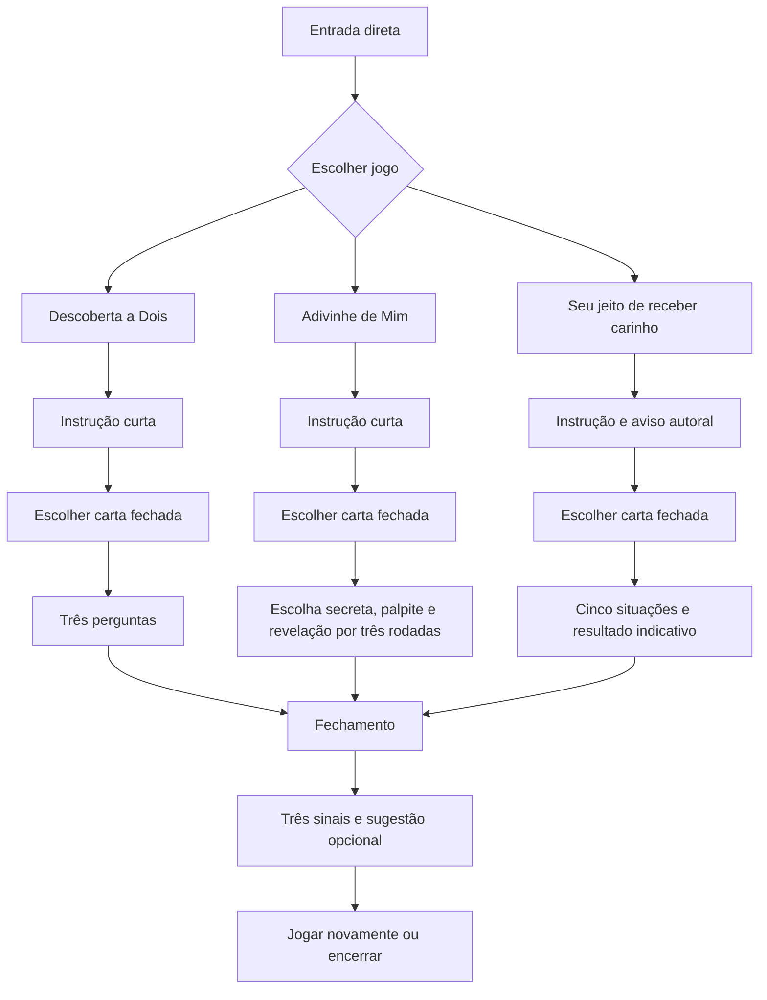

# Fluxo do MPV — jogos e amostra no mesmo celular

**Versão:** 1.2
**Data:** 17/09/2026
**Status:** implementado e em revalidação física

## Resultado esperado

Uma pessoa abre o link e escolhe entre dois jogos para o casal e uma amostra individual de preferências afetivas. Antes de cada pergunta, escolhe uma carta fechada para revelar. Não há conta, nomes ou mediação. Ao final, o casal ou a pessoa responde três sinais objetivos e pode escrever uma sugestão de melhoria.

## Jornada principal

## Estados de tela

| Estado | Conteúdo obrigatório | Ações | Próximo estado |
|---|---|---|---|
| MPV-01 Entrada | proposta em uma frase, três cartões de experiência, duração aproximada | escolher experiência | MPV-02 |
| MPV-02 Instrução | regra em até três passos, aviso para passar o celular quando aplicável | começar, voltar | MPV-03 ou MPV-04 |
| MPV-02A Baralho | cartas fechadas restantes, rodada e instrução de toque | escolher carta, sair | pergunta da experiência |
| MPV-03 Descoberta | pergunta revelada, rodada `1 de 3`, lembrete para ambos responderem em voz alta | próxima carta, pular, sair | MPV-02A ou MPV-06 |
| MPV-04 Escolha secreta | pergunta e opções para quem responde sobre si | confirmar escolha, pular, sair | MPV-05 |
| MPV-05 Palpite e revelação | bloqueio “passe o celular”, palpite da outra pessoa e comparação final | revelar, próxima, pular, sair | alternar papel ou MPV-06 |
| MPV-05A Amostra de carinho | situação revelada e cinco gestos autorais | escolher gesto, próxima carta | resultado após cinco respostas |
| MPV-05B Resultado indicativo | duas preferências mais fortes, distribuição e aviso não diagnóstico | enviar feedback, refazer, encerrar | MPV-06 ou MPV-01 |
| MPV-06 Fechamento | conclusão, três perguntas de feedback e sugestão opcional | escrever, enviar, jogar novamente, encerrar | MPV-01 ou fim |

## Fluxo 1 — Descoberta a Dois

1. O casal escolhe **Descoberta a Dois**.
2. A instrução informa: “Leiam a pergunta, respondam em voz alta e conversem sem pressa”.
3. O app mostra as cartas fechadas restantes e o casal escolhe qual revelar.
4. O casal toca em **Próxima** quando ambos terminarem ou em **Pular** se não quiser responder.
5. Após três cartas exibidas ou puladas, o app abre o fechamento.

Regras:

- o app não solicita nem armazena respostas;
- pular também consome a rodada para manter a sessão curta;
- sair exige confirmação simples e não salva progresso;
- cartas não se repetem dentro da mesma sessão.

## Fluxo 2 — Adivinhe de Mim

1. O casal escolhe **Adivinhe de Mim**.
2. A instrução explica que uma pessoa escolhe em segredo e a outra tenta adivinhar.
3. Na primeira rodada, a tela identifica apenas **Pessoa 1**, sem pedir nome.
4. Pessoa 1 seleciona uma opção e confirma.
5. O app cobre a escolha e mostra: “Passe o celular para a Pessoa 2”.
6. Pessoa 2 confirma que recebeu o aparelho e faz o palpite.
7. O app revela escolha e palpite juntos, sem pontuação acumulada.
8. Na rodada seguinte, os papéis são invertidos automaticamente.
9. Após três rodadas, o app abre o fechamento.

Regras:

- a escolha secreta existe apenas na memória da sessão;
- voltar não pode revelar a escolha anterior;
- a tela de passagem não mostra pergunta, opções ou escolha;
- não usar ranking, vencedor, compatibilidade ou avaliação da pessoa parceira;
- pular limpa escolha e palpite antes de avançar.

## Fluxo 3 — Seu jeito de receber carinho

1. A pessoa lê o aviso de que a amostra é autoral, indicativa e não oficial.
2. Escolhe uma das cartas fechadas restantes para revelar uma situação.
3. Seleciona, entre cinco gestos, aquele que mais combina com ela hoje.
4. Repete o fluxo por cinco perguntas sorteadas entre seis situações.
5. O app soma localmente as escolhas e mostra as duas preferências mais fortes e a distribuição completa.
6. A pontuação e as respostas são descartadas ao atualizar, sair ou refazer; somente o feedback final opcional pode chegar ao servidor.

## Fechamento e feedback

O fechamento usa respostas **Sim / Não** para reduzir esforço:

1. “Foi fácil entender como jogar?”
2. “Vocês descobriram algo ou se sentiram mais conectados?”
3. “Jogariam novamente?”

Depois dos três sinais, um campo opcional permite escrever até 500 caracteres com sugestões de melhoria. A interface orienta a não incluir nomes, contatos ou detalhes da conversa.

Após o envio, mostrar agradecimento e duas ações: **Jogar novamente** e **Encerrar**.

O evento de conclusão pode registrar somente identificador anônimo da sessão, jogo escolhido, conclusão ou abandono, os três sinais e a sugestão opcional. Nenhuma resposta da rodada, escolha íntima, nome ou dado de contato faz parte do MPV.

Na versão controlada, cada envio é encaminhado a `POST /api/mpv/feedback` e armazenado no servidor com identificador idempotente, horário, jogo, `clarity`, `connection`, `replayIntent` e `suggestion`. A interface só confirma após a API aceitar o registro e mantém o formulário disponível para nova tentativa em caso de falha. Não há persistência de perguntas, opções ou respostas das rodadas.

## Saídas e exceções

- **Sair durante o jogo:** confirmar “Encerrar esta sessão?”; confirmar limpa o estado e volta à entrada.
- **Atualizar a página:** reiniciar na entrada, sem tentativa de recuperação.
- **Sem conexão após carregar:** a sessão continua se os recursos já estiverem disponíveis; não prometer modo offline.
- **Falha no envio do feedback:** permitir tentar novamente ou encerrar; nunca bloquear a saída.
- **Todas as cartas puladas:** permitir concluir e registrar a sessão como concluída com três pulos.

## Hierarquia e navegação

- não exibir barra inferior, perfil, área administrativa ou atalhos do produto completo;
- manter apenas voltar na instrução e sair durante uma rodada;
- o símbolo inicial pode voltar à entrada apenas fora de uma sessão;
- uma ação primária por estado;
- progresso visível em todas as rodadas.

## Critérios de aceite

- a entrada apresenta os dois jogos e a amostra autoral aprovados para o MPV;
- título da aba, metadados, cabeçalho e rodapé não exibem o nome do aplicativo;
- o primeiro jogo começa em no máximo dois toques;
- nenhum estado exige cadastro, nome, e-mail, convite ou pareamento;
- cada sessão tem exatamente três rodadas;
- a amostra individual tem exatamente cinco perguntas e não é descrita como teste oficial ou diagnóstico;
- cada pergunta começa com uma escolha acessível entre cartas fechadas;
- ambos os jogos permitem pular e sair;
- Adivinhe de Mim alterna os papéis e protege a escolha na passagem do aparelho;
- Descoberta a Dois não apresenta campo de resposta;
- o fechamento coleta os três sinais definidos e aceita uma sugestão opcional de até 500 caracteres;
- reiniciar, sair ou trocar de jogo elimina o estado da sessão;
- o caminho principal funciona em viewport de 320 px sem rolagem horizontal;
- controles são acessíveis por teclado e possuem rótulos claros para leitores de tela.

## Mapeamento para a implementação existente

- `src/App.tsx`: o MPV deve entrar antes das decisões de onboarding, autenticação e pareamento.
- `src/features/game/GamePage.tsx`: podem ser reaproveitados cartões, progresso e estilos; o formulário de resposta escrita e os onze temas não pertencem ao recorte.
- `src/features/game/activities.json`: será reduzido logicamente ao lote de doze cartas definido na tarefa 4.
- navegação inferior, testes de personalidade, revelação remota, perfil e administração ficam apenas fora do caminho do MPV.

Não remover definitivamente as funcionalidades anteriores nesta etapa. A tarefa 5 deve isolá-las do caminho principal, permitindo recuperação posterior após a decisão do formato.
