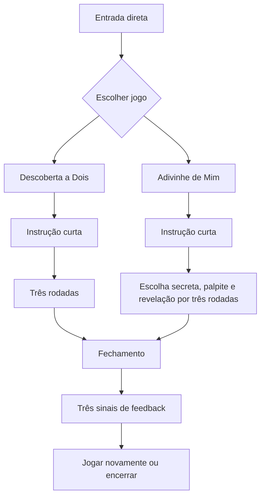

# Fluxo do MPV — dois jogos no mesmo celular

**Versão:** 1.0  
**Data:** 12/09/2026  
**Status:** aprovado para implementação

## Resultado esperado

Uma pessoa abre o link, escolhe um dos dois jogos e o casal conclui três rodadas no mesmo celular sem criar conta, informar nomes ou receber mediação. Ao final, o casal responde três perguntas objetivas de feedback.

## Jornada principal

## Estados de tela

| Estado | Conteúdo obrigatório | Ações | Próximo estado |
|---|---|---|---|
| MPV-01 Entrada | proposta em uma frase, dois cartões de jogo, duração aproximada | escolher jogo | MPV-02 |
| MPV-02 Instrução | regra em até três passos, aviso para passar o celular quando aplicável | começar, voltar | MPV-03 ou MPV-04 |
| MPV-03 Descoberta | pergunta, rodada `1 de 3`, lembrete para ambos responderem em voz alta | próxima, pular, sair | próxima rodada ou MPV-06 |
| MPV-04 Escolha secreta | pergunta e opções para quem responde sobre si | confirmar escolha, pular, sair | MPV-05 |
| MPV-05 Palpite e revelação | bloqueio “passe o celular”, palpite da outra pessoa e comparação final | revelar, próxima, pular, sair | alternar papel ou MPV-06 |
| MPV-06 Fechamento | conclusão, três perguntas de feedback | enviar, jogar novamente, encerrar | MPV-01 ou fim |

## Fluxo 1 — Descoberta a Dois

1. O casal escolhe **Descoberta a Dois**.
2. A instrução informa: “Leiam a pergunta, respondam em voz alta e conversem sem pressa”.
3. O app exibe uma carta por vez.
4. O casal toca em **Próxima** quando ambos terminarem ou em **Pular** se não quiser responder.
5. Após três cartas exibidas ou puladas, o app abre o fechamento.

Regras:

- o app não solicita nem armazena respostas;
- pular também consome a rodada para manter a sessão curta;
- sair exige confirmação simples e não salva progresso;
- cartas não se repetem dentro da mesma sessão.

## Fluxo 2 — Adivinhe de Mim

1. O casal escolhe **Adivinhe de Mim**.
2. A instrução explica que uma pessoa escolhe em segredo e a outra tenta adivinhar.
3. Na primeira rodada, a tela identifica apenas **Pessoa 1**, sem pedir nome.
4. Pessoa 1 seleciona uma opção e confirma.
5. O app cobre a escolha e mostra: “Passe o celular para a Pessoa 2”.
6. Pessoa 2 confirma que recebeu o aparelho e faz o palpite.
7. O app revela escolha e palpite juntos, sem pontuação acumulada.
8. Na rodada seguinte, os papéis são invertidos automaticamente.
9. Após três rodadas, o app abre o fechamento.

Regras:

- a escolha secreta existe apenas na memória da sessão;
- voltar não pode revelar a escolha anterior;
- a tela de passagem não mostra pergunta, opções ou escolha;
- não usar ranking, vencedor, compatibilidade ou avaliação da pessoa parceira;
- pular limpa escolha e palpite antes de avançar.

## Fechamento e feedback

O fechamento usa respostas **Sim / Não** para reduzir esforço:

1. “Foi fácil entender como jogar?”
2. “Vocês descobriram algo ou se sentiram mais conectados?”
3. “Jogariam novamente?”

Após o envio, mostrar agradecimento e duas ações: **Jogar novamente** e **Encerrar**.

O evento de conclusão pode registrar somente identificador anônimo da sessão, jogo escolhido, conclusão ou abandono e os três sinais. Nenhum texto, escolha da rodada, nome ou dado de contato faz parte do MPV.

No teste atual, cada envio fica somente no armazenamento local do aparelho, na chave neutra `mpv.feedback.v1`, com quatro campos: `completedGame`, `clarity`, `connection` e `replayIntent`. Não há envio para servidor nem persistência de perguntas, opções ou respostas das rodadas.

## Saídas e exceções

- **Sair durante o jogo:** confirmar “Encerrar esta sessão?”; confirmar limpa o estado e volta à entrada.
- **Atualizar a página:** reiniciar na entrada, sem tentativa de recuperação.
- **Sem conexão após carregar:** a sessão continua se os recursos já estiverem disponíveis; não prometer modo offline.
- **Falha no envio do feedback:** permitir tentar novamente ou encerrar; nunca bloquear a saída.
- **Todas as cartas puladas:** permitir concluir e registrar a sessão como concluída com três pulos.

## Hierarquia e navegação

- não exibir barra inferior, perfil, área administrativa ou atalhos do produto completo;
- manter apenas voltar na instrução e sair durante uma rodada;
- o símbolo inicial pode voltar à entrada apenas fora de uma sessão;
- uma ação primária por estado;
- progresso visível em todas as rodadas.

## Critérios de aceite

- a entrada apresenta somente os dois jogos do MPV;
- título da aba, metadados, cabeçalho e rodapé não exibem o nome do aplicativo;
- o primeiro jogo começa em no máximo dois toques;
- nenhum estado exige cadastro, nome, e-mail, convite ou pareamento;
- cada sessão tem exatamente três rodadas;
- ambos os jogos permitem pular e sair;
- Adivinhe de Mim alterna os papéis e protege a escolha na passagem do aparelho;
- Descoberta a Dois não apresenta campo de resposta;
- o fechamento coleta exatamente os três sinais definidos;
- reiniciar, sair ou trocar de jogo elimina o estado da sessão;
- o caminho principal funciona em viewport de 320 px sem rolagem horizontal;
- controles são acessíveis por teclado e possuem rótulos claros para leitores de tela.

## Mapeamento para a implementação existente

- `src/App.tsx`: o MPV deve entrar antes das decisões de onboarding, autenticação e pareamento.
- `src/features/game/GamePage.tsx`: podem ser reaproveitados cartões, progresso e estilos; o formulário de resposta escrita e os onze temas não pertencem ao recorte.
- `src/features/game/activities.json`: será reduzido logicamente ao lote de doze cartas definido na tarefa 4.
- navegação inferior, testes de personalidade, revelação remota, perfil e administração ficam apenas fora do caminho do MPV.

Não remover definitivamente as funcionalidades anteriores nesta etapa. A tarefa 5 deve isolá-las do caminho principal, permitindo recuperação posterior após a decisão do formato.
