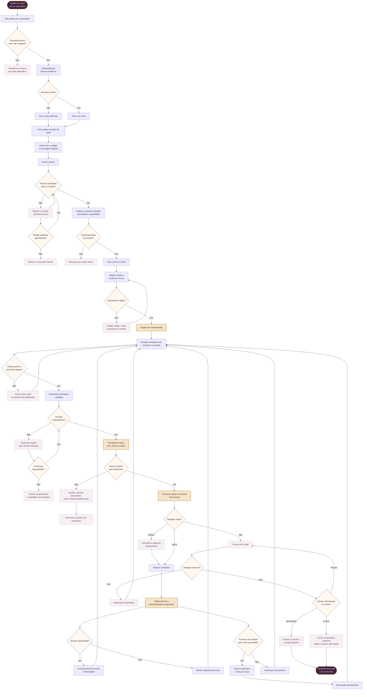

r540o# Fluxograma da jornada completa do casal — Conectadois

**Versão:** 1.0 — 4 de setembro de 2026  
**Status:** fluxo de referência para produto, UX, conteúdo, engenharia e qualidade  
**Fonte:** `JORNADA-COMPLETA-DO-CASAL.md`, PRD e escopo do MVP.

Este fluxograma representa uma jornada bilateral e assíncrona. A pessoa iniciadora e a pessoa convidada mantêm autonomia individual; o valor do produto só é considerado entregue quando ambas participam e a experiência provoca uma interação significativa do casal.

## 1. Jornada ponta a ponta

## 2. Núcleo bilateral em raias

```mermaid
flowchart LR
    subgraph INI[Pessoa iniciadora]
        I1[Conhece o produto] --> I2[Cria conta e espaço]
        I2 --> I3[Envia convite]
        I3 --> I4[Aguarda sem pressionar]
        I4 --> I5[Escolhe ou aceita atividade]
        I5 --> I6[Responde individualmente]
        I6 --> I7[Aguarda resposta parceira]
        I7 --> I8[Vê revelação mútua]
    end

    subgraph SIS[Sistema Conectadois]
        S1[Explica valor e privacidade] --> S2[Gera convite seguro]
        S2 --> S3[Valida aceite e pareamento]
        S3 --> S4[Apresenta tema e intensidade]
        S4 --> S5[Sela cada resposta]
        S5 --> S6{Duas respostas<br/>concluídas?}
        S6 -- Não --> S7[Exibe somente estado de espera]
        S7 --> S6
        S6 -- Sim --> S8[Libera respostas simultaneamente]
        S8 --> S9[Propõe conversa ou gesto opcional]
    end

    subgraph CON[Pessoa convidada]
        C1[Recebe convite] --> C2[Entende intenção e segurança]
        C2 --> C3{Aceita livremente?}
        C3 -- Não --> C4[Recusa sem informar motivo íntimo]
        C3 -- Sim --> C5[Cria conta e confirma vínculo]
        C5 --> C6[Escolhe ou aceita atividade]
        C6 --> C7[Responde individualmente]
        C7 --> C8[Aguarda resposta parceira]
        C8 --> C9[Vê revelação mútua]
    end

    I1 --> S1
    I3 --> S2
    S2 --> C1
    C5 --> S3
    S3 --> I5
    S3 --> C6
    I6 --> S5
    C7 --> S5
    S7 --> I7
    S7 --> C8
    S8 --> I8
    S8 --> C9
    I8 --> S9
    C9 --> S9
    S9 --> V([Valor do casal:<br/>descoberta e conexão fora da tela])

    classDef actor fill:#FFF8EF,color:#3D1F3D,stroke:#8D627F;
    classDef system fill:#F6EFF4,color:#3D1F3D,stroke:#B993AA;
    classDef value fill:#3D1F3D,color:#FFF8EF,stroke:#D4A94E,stroke-width:2px;
    class I1,I2,I3,I4,I5,I6,I7,I8,C1,C2,C3,C4,C5,C6,C7,C8,C9 actor;
    class S1,S2,S3,S4,S5,S6,S7,S8,S9 system;
    class V value;
```

## 3. Regras que atravessam todo o fluxo

- **Autonomia:** qualquer pessoa pode pular, pausar, recusar, desvincular ou excluir sem precisar justificar uma decisão íntima.
- **Reciprocidade:** pareamento, participação e revelação dependem de condições bilaterais explícitas.
- **Privacidade:** respostas permanecem seladas até ambas concluírem; analytics não recebe conteúdo íntimo.
- **Segurança emocional:** tema e intensidade aparecem antes da atividade, sem diagnóstico, pontuação do amor ou resposta “certa”.
- **Assincronia:** nenhuma etapa exige que as duas pessoas estejam online ao mesmo tempo.
- **Valor fora da tela:** a métrica de sucesso não é apenas concluir a atividade, mas gerar descoberta, conversa ou gesto significativo.
- **Monetização posterior:** o Premium surge somente depois da primeira experiência completa e nunca bloqueia controles de segurança, consentimento ou exclusão.

## 4. Marcos mensuráveis do funil

| Marco | Evento principal | Critério de sucesso |
|---|---|---|
| Aquisição | onboarding iniciado | proposta entendida em poucos segundos |
| Cadastro | `user_registered` | conta individual criada sem fricção crítica |
| Convite | `couple_created` + convite compartilhado | convite enviado com contexto e leveza |
| Pareamento | `couple_paired` | duas contas conectadas com consentimento |
| Ativação | `mutual_experience_completed` | ambas concluem a primeira experiência |
| Primeiro valor | `mutual_reveal_viewed` + sinal opcional | revelação gera conversa, gesto ou descoberta |
| Retenção | nova experiência mútua em até 7 dias | retorno voluntário do casal |
| Hábito | experiência mútua significativa semanal | recorrência com reciprocidade e conforto |
| Monetização | `trial_started` / `subscription_started` | decisão transparente depois do valor |
| Saída segura | desvinculação ou exclusão concluída | acesso revogado e tratamento de dados explicado |

## 5. Uso recomendado

O fluxo deve orientar arquitetura de informação, protótipos, critérios de aceite, eventos de analytics e cenários E2E. As hipóteses de linguagem, emoção, cadência e tolerância à espera ainda precisam ser validadas em entrevistas e testes com as duas pessoas do casal separadamente e, depois, em sessão conjunta opcional.
