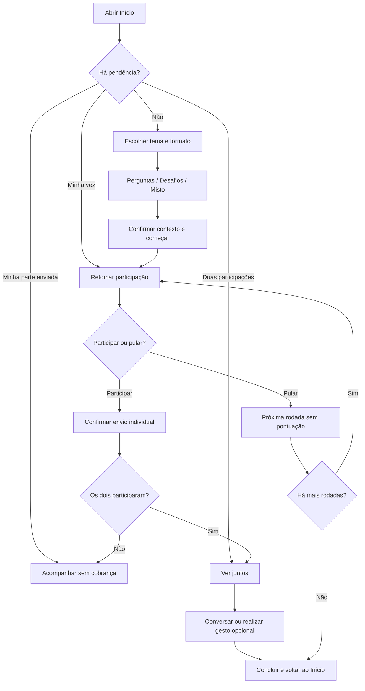

# Home e rotina diária — Conectadois

Versão 1.0 · 04/09/2026 · Tarefa 24.

Desenho funcional e protótipo navegável preparados para revisão. Validação com casais pendente na tarefa 30. Este desenho especifica a evolução da home; não altera a tela em produção.

Abra [o protótipo navegável](prototipo-home-rotina.html) no navegador. O seletor “Estado para revisão” permite comparar os cenários. Os dados são fictícios, as ações são simulações e nada é enviado ou salvo. O protótipo cobre home, configuração do momento, participação e conclusão; as demais áreas da navegação são destinos indicados para implementação posterior.

## Objetivo e hierarquia

A pessoa deve reconhecer seu próximo passo em até cinco segundos. A home prioriza o momento compartilhado em andamento e oferece uma sugestão curta quando não há pendências. A rotina é um convite: pular um dia não gera punição, mensagem de perda ou cobrança ao parceiro.

Ordem visual no celular:

1. Marca e acesso ao perfil; saudação adequada ao horário, sem deduzir estado emocional.
2. Uma mensagem de acolhimento: “Um momento para vocês.”
3. Um cartão principal contextual com tema, formato, duração estimada e uma ação de destaque.
4. “No ritmo de vocês”: escolher → participar → descobrir, com estado textual e sem ranking.
5. “Outro jeito de se conectar”: perguntas, desafios e modo misto levam à configuração inicial.
6. Gesto opcional, fácil de dispensar; não concede dias de conexão por clique.
7. Navegação persistente: Início, Explorar, Nós, Perfil.

No desktop, cartão principal e rotina ficam em duas colunas; exploração e gesto aparecem abaixo. Em telas pequenas, a ordem permanece a mesma e a navegação não cobre o último conteúdo.

## Prioridade e estados da home

Resolver autenticação e vínculo antes de carregar dados compartilhados. Entre estados elegíveis, seguir a prioridade da arquitetura de informação: alerta crítico → revelação pronta → minha participação → espera → convite → sugestão → exploração → gesto. Não mostrar atividades de um vínculo encerrado. Se houver várias partidas, priorizar a pendência elegível mais antiga e oferecer “Ver outros momentos” em Nós, sem perder a partida selecionada.

| ID / estado | Mensagem do cartão principal | Ação e destino |
| --- | --- | --- |
| HM-01 · Sem vínculo | “O primeiro passo é se encontrar por aqui.” | Criar nosso espaço → pareamento; Tenho um convite → entrada por código |
| HM-02 · Convite pendente | “Seu espaço está pronto para receber seu amor.” | Compartilhar convite → ação explícita da pessoa; alternativa copiar código com confirmação |
| HM-03 · Recém-pareado | “Agora este espaço é de vocês.” | Fazer primeira atividade → configuração, padrão leve |
| HM-04 · Minha vez | “Tem um momento esperando sua participação.” | Responder agora / Cumprir desafio → rodada pendente; mostrar tema e formato, sem resposta do parceiro |
| HM-05 · Espera | “Sua parte está guardada.” | Acompanhar status → atualizar participação; apoio: “A outra pessoa participa quando puder.” |
| HM-06 · Revelação pronta | “Vocês já podem descobrir juntos.” | Ver juntos → revelação; não antecipar respostas na home |
| HM-07 · Sem atividade | “Que tal alguns minutos de presença?” | Escolher momento → configuração; duração estimada de 3 a 10 minutos, sem cronômetro |
| HM-08 · Concluído hoje | “Mais um momento vivido a dois.” | Escolher outro momento → configuração, opcional; resumo só de participação, sem nota da relação |
| HM-09 · Retorno após pausa | “Que bom ter vocês por aqui.” | Escolher para hoje → configuração; não informar dias de ausência |
| HM-10 · Carregando | “Preparando o espaço de vocês…” | Sem CTA de criação até confirmar estado; skeleton sem anunciar conteúdo fictício |
| HM-11 · Erro recuperável | “Não foi possível atualizar seu espaço.” | Tentar novamente → repetir consulta, preservando contexto; nunca assumir conclusão |
| HM-12 · Sem conexão | “Vamos retomar quando a conexão voltar.” | Tentar novamente → consultar servidor; não confirmar envio, revelação ou progresso offline |
| HM-13 · Atenção à conta | “Precisamos confirmar seu acesso.” | Revisar acesso → autenticação/conta; ocultar conteúdo compartilhado até resolver |

Os títulos não expõem temas sensíveis na tela bloqueada. No app aberto, preferências de ocultação de tema devem ser respeitadas quando disponíveis. Nomes longos quebram linha; identificação e autorização sempre usam IDs, conforme o modelo de dados.

## Rotina do dia

### Escolher

Exibir tema, intensidade, tempo estimado e contexto de participação antes de começar. Oferecer perguntas discursivas, desafios ou modo misto. Os 11 temas atuais permanecem disponíveis: Filhos, Religioso, Apimentado, Descontraído, Papo sério, Memórias, Curiosidades, Carinho, Futuro, Valores e Parceria. A duração é estimativa editorial, não uma promessa nem um limite.

Para o primeiro uso, sugerir Descontraído, sem pré-selecionar tema íntimo. A escolha não deve ser modificada durante uma partida já iniciada. “Trocar tema” antes de começar preserva a escolha de formato. Partidas remotas exigem duas contas pareadas; o modo local deve dizer “Juntos neste dispositivo”. O protótipo simula o fluxo remoto futuro e explicita a simulação da outra pessoa.

### Participar

Perguntas discursivas usam campo rotulado, limite de 500 caracteres e confirmação bloqueada para texto vazio. A confirmação mostra “Sua parte está guardada” apenas após sucesso real da API na implementação. Durante envio, impedir repetição; em falha, manter o rascunho e permitir tentar novamente.

Desafios mostram ação concreta, estimativa e “Cumpri minha parte”. Cada pessoa confirma a própria participação; não oferecer botão para confirmar pela outra conta. “Pular atividade” e “Sair” permanecem acessíveis. Gestos físicos exigem vontade dos dois e adaptação ao conforto de cada um. Pular não revela eventual resposta já enviada.

### Descobrir e encerrar

Na revelação, apresentar as duas respostas com nomes, sem acerto/erro, nota ou interpretação psicológica. Desafios mostram as duas confirmações, sem comprovação por foto. Após a última rodada, “Concluir momento” retorna à home. Se todas foram puladas, usar “Momento encerrado” e não registrar participação mútua.

Não reiniciar automaticamente nem abrir outra atividade ao concluir. O convite seguinte é opcional. Interromper uma partida mantém a pendência real na home; só uma ação explícita de abandono encerra o fluxo definitivamente.

## Progresso e lembretes

O módulo de rotina mostra etapas da partida e, quando houver dados confiáveis, quantidade de momentos compartilhados na semana. Sem dados, usar “Seu primeiro momento pode começar hoje”, nunca um valor inventado. Não usar o streak atual do navegador como comprovação de atividade.

O backend contabiliza somente fatos de participação mútua, conforme [MODELO-DE-DADOS.md](MODELO-DE-DADOS.md). Ler a revelação, atualizar a home e clicar no gesto não aumentam progresso. Eventos não se duplicam em reenvios e a virada do dia respeita o fuso da partida. Home é uma projeção desse estado, não sua fonte de verdade.

Lembretes são opcionais, definidos em Perfil depois de explicar finalidade e frequência. Sem permissão, não pedir repetidamente. Oferecer pausa e desativação. Não enviar cobrança automática porque o parceiro ainda não respondeu. Conteúdo de notificações é genérico: “Um momento de vocês está disponível.” Configuração de notificações não está implementada neste protótipo.

## Componentes e acessibilidade

Usar ameixa, creme e dourado da identidade visual. Dourado é acento decorativo; texto pequeno usa cores escuras com contraste. Tipografia editorial para títulos e sem serifa para interface. Cartões arredondados, respiro de 16–24 px, um CTA principal por estado e ações secundárias de menor destaque.

Alvos de toque com ao menos 44 px, foco visível, rótulos explícitos e estados que não dependam de cor. Mudança de tela move foco para o título; atualização de status tem anúncio discreto. Layout deve suportar 320 px, zoom de 200%, nomes longos e redução de movimento. Não usar animação ou contagem regressiva para pressionar participação. A revisão visual e com tecnologias assistivas continua necessária antes de aceite.

## Dados e integração para a tarefa 65

A home precisa receber perfil, estado do vínculo, pendência prioritária, metadados da atividade, estado de participação de cada integrante e progresso agregado. Não carregar respostas íntimas na consulta da home. Buscar o conteúdo somente ao entrar na atividade/revelação com autorização. O contrato definitivo pertence à tarefa 35.

Revalidar estado ao retornar à aba, após enviar participação e antes da revelação. O polling, quando necessário, deve parar em aba oculta e tratar expiração de login. Falha de rede mantém o contexto, mas não libera resposta do parceiro nem cria conclusão otimista. Vínculo encerrado limpa o conteúdo em memória e retorna ao pareamento.

Lacunas da home atual: saudação fixa em “Boa noite”, pergunta privada fixa, streak iniciado por valor local, cliques que incrementam dias, ausência de erro/carregamento contextual e entrada de catálogo pouco explícita para desafios. A tarefa 65 deve integrar este desenho às tarefas 55 e 111, sem simular dados em produção.

## Verificação e aceite

| Cenário de revisão | Critério |
| --- | --- |
| Primeira visita de casal pareado | Entender o próximo passo sem explicação em até 5 segundos |
| Apenas uma pessoa respondeu | Encontrar status de espera e não conseguir ler a resposta da outra |
| Desafios | Localizar o formato antes de começar e compreender confirmação individual |
| Revelação | Home informa disponibilidade sem expor conteúdo |
| Pausa ou pulo | Retomar sem mensagem de culpa e sem progresso indevido |
| Falha/offline | Compreender a falha e tentar novamente sem perder contexto |
| Teclado e celular | Navegar, selecionar formato e responder sem bloqueio de foco ou sobreposição |

Registrar eventos de visualização da home, seleção de formato, início, participação, pulo, revelação e conclusão apenas com IDs técnicos e estado permitido. Não enviar textos, nomes ou temas sensíveis em propriedades analíticas. O catálogo de eventos e sua implementação devem ser revisados na tarefa 106.

O protótipo tem cenários e dados de demonstração para revisão individual; não testa rede, autorização real, sincronização entre contas ou persistência. A tarefa 24 fica em andamento até validação do fluxo. As tarefas 27 e 29 registram a contribuição deste desenho sem considerar completos os wireframes e o protótipo do aplicativo inteiro.

O detalhamento da etapa de participação está em [Perguntas e revelação mútua](PERGUNTAS-E-REVELACAO-MUTUA.md), com [protótipo próprio](prototipo-perguntas-revelacao.html) para revisar resposta, espera, pulo e revelação nas duas perspectivas.
