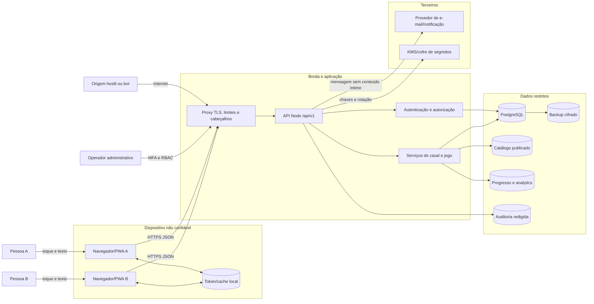

# Modelagem de ameaças — Conectadois

Versão 1.0 · 05/09/2026 · Entrega da tarefa 36.

## Decisão de segurança

O estado atual **não está apto para piloto externo**. A modelagem identificou 23 ameaças: 13 críticas, 9 altas e 1 média no risco inerente. Os bloqueadores imediatos são sequestro de convite, roubo ou reutilização de sessão, acesso indevido entre casais, revelação antecipada, corridas de escrita, perda silenciosa do JSON e exposição de conteúdo íntimo.

Esta entrega define ameaças e controles; não afirma que as mitigações foram implementadas. Cada ameaça permanece aberta até existir evidência automatizada ou operacional do controle correspondente. O modelo precisa ser revisto quando as tarefas 112–114 definirem novas mecânicas, quando a persistência migrar para PostgreSQL, quando houver provedor externo ou antes de cada release candidate.

## Método e referências

A análise segue as quatro etapas do [OWASP Threat Modeling Cheat Sheet](https://cheatsheetseries.owasp.org/cheatsheets/Threat_Modeling_Cheat_Sheet.html): decompor, identificar e priorizar, definir respostas e revisar. STRIDE organiza as categorias; o [OWASP API Security Top 10 2023](https://owasp.org/API-Security/editions/2023/en/0x11-t10/) complementa riscos de autorização por objeto e função, autenticação, consumo de recursos, fluxos sensíveis, configuração e inventário. Os requisitos servem como base verificável alinhada ao [OWASP ASVS 5.0](https://owasp.org/www-project-application-security-verification-standard/) e ao [NIST SSDF SP 800-218](https://csrc.nist.gov/pubs/sp/800/218/final).

### Escala

- probabilidade: 1 rara, 2 improvável, 3 possível, 4 provável, 5 muito provável;
- impacto: 1 mínimo, 2 baixo, 3 relevante, 4 grave, 5 crítico para pessoas, privacidade ou operação;
- risco inerente = probabilidade × impacto;
- nível: baixo 1–5, médio 6–11, alto 12–19, crítico 20–25.

O impacto de exposição de respostas, temas evitados, resultados pessoais, vínculo ou credenciais recebe peso 5. O produto trata conteúdo relacional que pode gerar constrangimento, conflito ou dano fora do aplicativo; uma leitura indevida não é apenas um defeito técnico.

## Escopo e premissas

Incluídos:

- PWA/SPA React em navegador móvel ou desktop;
- API Node atual em `/api` e contrato-alvo `/api/v1`;
- cadastro, login, sessão, recuperação e verificação;
- criação de casal, convite, pareamento, desvinculação e exclusão;
- catálogo, partidas, rodadas, respostas privadas, revelação e progresso;
- feedback anônimo do MPV, exportação CSV, analytics, painel administrativo, logs, segredos, backups e CI/CD;
- PostgreSQL planejado e JSON atual;
- e-mail, notificações e cache offline planejados.

Premissas: público adulto; duas contas individuais; produção no mesmo host com HTTPS; piloto gratuito sem cobrança real; nenhum conteúdo íntimo deve sair em analytics, logs ou notificações; não existe promessa de criptografia ponta a ponta.

Fora do controle direto: sistema operacional comprometido, aparelho com root, captura física de tela, coerção fora do produto e comprometimento do provedor de e-mail. O desenho ainda reduz o impacto com sessão revogável, minimização, notificações discretas e saída unilateral do vínculo.

## Ativos e classificação

| Classe | Ativos | Consequência dominante |
|---|---|---|
| S4 — íntimo/restrito | textos de resposta, escolhas, resultados, temas evitados, snapshots de rodadas | dano relacional, exposição sensível, perda de confiança |
| S4 — segredo | senha, token de sessão, token de recuperação, convite válido, chaves e segredos | tomada de conta, entrada indevida no casal, acesso em cadeia |
| S3 — pessoal | nome, e-mail, aniversário, fuso, vínculo e histórico de participação | identificação, enumeração, engenharia social |
| S3/S4 — texto de pesquisa | sugestão opcional do MPV quando a pessoa ignora a orientação e inclui dado pessoal ou sensível | identificação, exposição indevida e uso além da finalidade |
| S2 — operacional | métricas agregadas, logs redigidos, configuração e inventário de conteúdo | fraude analítica, abuso administrativo, reconhecimento |
| S1 — público | frontend compilado e conteúdo editorial publicado | adulteração de interface, cadeia de suprimentos |

S4 nunca entra em URL, log, analytics, notificação, cache público, mensagem de erro ou exemplo de documentação. Prazo de retenção e base legal dependem da tarefa 37.

## Diagrama de fluxo de dados

## Fronteiras de confiança

| Fronteira | Dados que cruzam | Regra obrigatória |
|---|---|---|
| TB-01 Pessoa → navegador | credenciais, respostas, preferências | minimizar, não persistir rascunho íntimo sem consentimento, proteger contra observação casual |
| TB-02 Navegador → borda | token, comandos, conteúdo S3/S4 | HTTPS, validação completa, rate limit, CORS restrito e proteção CSRF quando houver cookie |
| TB-03 Borda → API | identidade de rede e payload | não confiar em cabeçalhos do cliente; normalizar IP/proxy conhecido; limitar tamanho e tempo |
| TB-04 API → domínio | sujeito, ação e recurso | autorização central, negação por padrão, autoria derivada da sessão |
| TB-05 Domínio → dados | respostas, vínculo e progresso | transação, constraints, cifra, conta de banco com privilégio mínimo |
| TB-06 API → administração | métricas e operação editorial | RBAC, MFA, auditoria, nenhuma resposta íntima |
| TB-07 API → terceiro | e-mail, notificação e chaves | contrato mínimo, timeout, validação da resposta, segredo no cofre, sem texto íntimo |
| TB-08 Dados → backup/observabilidade | banco, logs e eventos | cifra, retenção, acesso restrito, restauração testada e redação |

## Controles atuais observados

- senha derivada com `scrypt`, salt aleatório e comparação constante;
- token de sessão aleatório de 32 bytes e UUIDs gerados pelo servidor;
- autenticação antes das rotas privadas;
- autoria da resposta obtida da sessão, não do corpo da requisição;
- resposta alheia omitida até existirem duas participações na pergunta fixa;
- verificação administrativa no servidor por lista configurada;
- limite de 100 KB para corpo e allowlist parcial de nomes/propriedades de analytics;
- React escapa texto interpolado e não há `dangerouslySetInnerHTML` identificado.

Esses controles reduzem risco, mas não compensam os bloqueadores abaixo.

## Registro de ameaças

| ID | STRIDE / API | Cenário e evidência | P | I | Risco | Resposta e controles | Situação |
|---|---|---|---:|---:|---:|---|---|
| T01 | E/I · BOLA | Conta altera `sessionId` ou `roundId` e lê/escreve rodada de outro casal. A v1 planeja IDs em URL e ainda não possui suíte negativa. | 5 | 5 | 25 crítico | Mitigar: SEC-08, SEC-09, SEC-27; tarefas 53, 54 e 84 | Aberta |
| T02 | E · BFLA | Conta comum chama administração, publicação editorial ou operação futura reservada. A métrica atual verifica admin, mas o modelo de papéis é uma lista de e-mails. | 4 | 5 | 20 crítico | Mitigar: SEC-08, SEC-21, SEC-25, SEC-27; tarefas 59, 84 e 106 | Aberta |
| T03 | S/D · autenticação | Credential stuffing e força bruta exploram login/cadastro sem rate limit; `scryptSync` bloqueia o event loop a cada tentativa. | 5 | 4 | 20 crítico | Mitigar: SEC-05, SEC-06, SEC-18, SEC-26; tarefas 45, 83 e 85 | Aberta |
| T04 | S/I | XSS, extensão ou script no aparelho lê o bearer token do `localStorage`; o mesmo token fica em texto no JSON por 30 dias. | 4 | 5 | 20 crítico | Mitigar: SEC-02, SEC-03, SEC-04, SEC-13; tarefas 42, 45 e 74 | Aberta |
| T05 | S/E · fluxo sensível | Código `AMOR-` usa 2 bytes, não expira, não é consumido como segredo armazenado em hash e pode ser adivinhado para ocupar a segunda vaga. | 5 | 5 | 25 crítico | Eliminar desenho atual: SEC-07, SEC-18, SEC-27; tarefas 48, 49 e 84 | Aberta |
| T06 | I · exposição excessiva | Erro de projeção, cache ou condição de corrida revela resposta da outra pessoa antes da condição bilateral. | 4 | 5 | 20 crítico | Mitigar: SEC-08, SEC-09, SEC-10, SEC-20, SEC-27; tarefas 53, 54, 81 e 84 | Aberta |
| T07 | T/R · lógica | Responder, corrigir, pular ou concluir em paralelo cria duas revelações, sobrescreve resposta ou duplica progresso. JSON não fornece transação ou lock. | 4 | 5 | 20 crítico | Mitigar: SEC-10, SEC-11, SEC-12, SEC-27; tarefas 41, 53–55 e 81 | Aberta |
| T08 | T/D/R | Escritas concorrentes ou processo interrompido corrompem `database.json`; falha de leitura retorna banco vazio e uma gravação posterior pode substituir dados. | 4 | 5 | 20 crítico | Eliminar JSON: SEC-12, SEC-16, SEC-26; tarefas 41, 81, 93 e 118 | Aberta |
| T09 | I | Respostas, tokens, e-mails e vínculos ficam em texto no mesmo arquivo e podem vazar em disco, cópia ou backup. | 4 | 5 | 20 crítico | Mitigar: SEC-04, SEC-13, SEC-14, SEC-16; tarefas 37, 41, 42 e 118 | Aberta |
| T10 | I/R | Stack, mensagem interna, log, métrica ou painel inclui token, convite, ID correlacionável ou texto íntimo. O `500` agora é genérico e a observabilidade básica possui teste com canário privado, mas auditoria e destinos definitivos ainda não existem. | 4 | 5 | 20 crítico | Mitigação parcial: SEC-09, SEC-15, SEC-22, SEC-25; tarefas 84 e 106 | Aberta |
| T11 | T/S/I · injeção | XSS por conteúdo editorial, dependência ou futura renderização rica executa no mesmo contexto e lê sessão/respostas. | 3 | 5 | 15 alto | Mitigar: SEC-02, SEC-03, SEC-17, SEC-28; tarefas 59, 74 e 83 | Aberta |
| T12 | I/S · configuração | Produção sem HTTPS/HSTS, CORS `*`, ausência de CSP e cache inseguro ampliam interceptação, origens hostis e retenção no navegador. | 4 | 5 | 20 crítico | Mitigar: SEC-01, SEC-02, SEC-19, SEC-20; tarefas 38, 73, 92 e 119 | Aberta |
| T13 | D · recursos | Rajada de login, eventos, respostas ou consultas consome CPU, memória, disco e conexões; não há quotas, timeout ou backpressure. | 4 | 4 | 16 alto | Mitigar: SEC-05, SEC-17, SEC-18, SEC-26; tarefas 43, 83 e 85 | Aberta |
| T14 | T/R · propriedade/função | Cliente fabrica eventos, datas ou propriedades e adultera North Star, retenção ou receita. Eventos financeiros são aceitos hoje pelo navegador. | 5 | 4 | 20 crítico | Eliminar eventos financeiros do cliente: SEC-11, SEC-22, SEC-25, SEC-27; tarefas 81 e 106 | Aberta |
| T15 | T · mass assignment | Campo não previsto altera papel, casal, autoria, status, progresso ou publicação se handlers futuros copiarem objetos inteiros. | 3 | 4 | 12 alto | Mitigar: SEC-08, SEC-09, SEC-17, SEC-27; tarefas 35, 59, 79 e 81 | Aberta |
| T16 | S/E | Recuperação ou verificação enumerável, token reutilizável ou link vazado permite tomada de conta. Os fluxos ainda não existem. | 3 | 5 | 15 alto | Mitigar: SEC-05, SEC-23, SEC-25, SEC-27; tarefas 46, 47 e 84 | Aberta |
| T17 | E/I | Ex-integrante usa sessão ou ID antigo após desvinculação; respostas ou resultados migram indevidamente para novo casal. | 4 | 5 | 20 crítico | Mitigar: SEC-08, SEC-11, SEC-24, SEC-27; tarefas 50, 81, 84 e 90 | Aberta |
| T18 | S/E | Conta administrativa comprometida ou e-mail configurado incorretamente acessa métricas, conteúdo e futura operação editorial. | 3 | 5 | 15 alto | Mitigar: SEC-04, SEC-14, SEC-21, SEC-25; tarefas 42, 59, 83 e 106 | Aberta |
| T19 | T/E · configuração/cadeia | Dependência, pipeline, segredo ou artefato adulterado injeta código; CI e bloqueio preventivo de segredos foram adicionados, mas análise de dependências, SBOM, cofre definitivo e rotação comprovada ainda faltam. | 3 | 5 | 15 alto | Mitigar: SEC-14, SEC-26, SEC-27; tarefas 39, 40, 42 e 83 | Aberta |
| T20 | I · privacidade relacional | Notificação, histórico do navegador, cache offline, preview, tela compartilhada ou texto explícito revela participação e conteúdo a quem usa o aparelho. | 4 | 4 | 16 alto | Mitigar: SEC-20, SEC-25, SEC-29; tarefas 58, 72, 73, 90 e 119 | Aberta |
| T21 | T/I · fluxo sensível | Conteúdo não aprovado, retirado ou inadequado é servido; snapshot muda depois da resposta ou operador publica sem dupla revisão. | 3 | 4 | 12 alto | Mitigar: SEC-11, SEC-21, SEC-28; tarefas 52, 59, 76 e 77 | Aberta |
| T22 | R | Sem trilha confiável, não é possível provar revogação, pareamento, publicação, acesso administrativo ou incidente sem registrar conteúdo íntimo. | 3 | 3 | 9 médio | Mitigar: SEC-15, SEC-21, SEC-25; tarefas 43, 59 e 84 | Aberta |
| T23 | S/T/I/D · feedback | Origem hostil automatiza feedback anônimo, sugestão inclui dado pessoal, reenvio duplica resultado ou CSV executa fórmula e expõe o arquivo. | 4 | 4 | 16 alto | Mitigar: SEC-17, SEC-18, SEC-19, SEC-25, SEC-27 e SEC-30; tarefa 139 | Aberta |

## Requisitos de segurança

| ID | Requisito verificável | Estado | Plano principal |
|---|---|---|---|
| SEC-01 | Servir produção somente por TLS moderno; redirecionar HTTP; aplicar HSTS depois de validar todos os subdomínios. | Ausente | 38, 92 |
| SEC-02 | Aplicar CSP com `script-src` sem `unsafe-inline`, proteção de frame, `nosniff`, política de referência e permissões mínimas. | Ausente | 38, 74, 92 |
| SEC-03 | Antes da v1 estável, decidir sessão web que não deixe credencial duradoura em `localStorage`; preferência por cookie `HttpOnly`, `Secure`, `SameSite` e defesa CSRF, ou access token curto somente em memória com rotação segura. | Aberto | 35, 42, 45 |
| SEC-04 | Guardar somente hash do token de sessão; suportar expiração absoluta e ociosa, rotação, logout, revogação por troca de senha e encerramento de conta. | Ausente | 42, 45–47 |
| SEC-05 | Limitar cadastro, login, recuperação e convite por IP, conta e janela; resposta não pode enumerar conta; registrar alerta sem senha. | Ausente | 43, 45–49 |
| SEC-06 | Manter KDF com salt e parâmetros calibrados; política mínima de 10 caracteres no contrato; comparar em tempo constante e permitir aumento de custo. | Parcial | 44–46, 79 |
| SEC-07 | Emitir convite com pelo menos 128 bits aleatórios, TTL padrão de 72 horas e máximo de 7 dias; guardar hash; uso único; reemissão revoga anterior; nunca logar código. | Ausente | 48, 49, 63 |
| SEC-08 | Centralizar decisão `sujeito + ação + recurso`; negar por padrão; derivar usuário/casal da sessão e escopar consulta por vínculo vigente. | Parcial | 35, 49, 53, 59, 84 |
| SEC-09 | Montar DTOs por allowlist; nunca serializar entidade de banco diretamente; resposta de erro não contém stack, segredo ou existência de objeto proibido. | Parcial | 35, 53, 59, 73 |
| SEC-10 | Resolver revelação somente na transação da segunda participação; antes disso `revelation` é nulo e a resposta da outra pessoa não é carregada na projeção. | Parcial | 53, 54, 81, 84 |
| SEC-11 | Usar constraints, locks na ordem casal → partida → rodada, idempotência e ETag; um evento de progresso por rodada. | Ausente | 41, 53–55, 81 |
| SEC-12 | Migrar para PostgreSQL com escrita atômica; falha de leitura ou gravação fecha a operação e preserva o último estado confirmado. | Ausente | 41, 81, 93 |
| SEC-13 | Cifrar volumes e backups; cifrar em nível de aplicação os valores S4 com envelope/KMS e separar chaves por ambiente; plaintext existe apenas durante a operação autorizada. | Ausente | 37, 41, 42, 93 |
| SEC-14 | Manter segredos em cofre, com privilégio mínimo, rotação, inventário, separação por ambiente e bloqueio de commit; já há inventário, geração local, injeção no Render, runtime, pre-commit e CI, com cofres definitivos e rotação pendentes. | Parcial | 40, 42 |
| SEC-15 | Logar request ID, decisão e resultado sem corpo S4; auditoria append-only para login, sessão, convite, vínculo, publicação, admin e exclusão; relógio UTC confiável. | Parcial | 59, 84 — logs HTTP estruturados sem corpo implementados; auditoria de domínio pendente |
| SEC-16 | Backup cifrado, acesso restrito, retenção definida, teste de restauração e impedimento de sobrescrita por banco vazio. | Ausente | 37, 93, 118 |
| SEC-17 | Validar schema, tipo de conteúdo, tamanho, Unicode e limites no servidor; rejeitar campos desconhecidos e upload não previsto. | Parcial | 35, 52, 79, 81 |
| SEC-18 | Aplicar quotas, timeout e backpressure por operação; proteger fluxos sensíveis contra automação sem bloquear o casal legítimo. | Ausente | 43, 83, 85 |
| SEC-19 | Permitir CORS somente às origens configuradas; sem refletir origem; se usar cookie, exigir `SameSite`, token/origem CSRF e credenciais apenas onde necessário. | Ausente | 38, 42, 92 |
| SEC-20 | Enviar `Cache-Control: no-store` em conta, casal, respostas, resultados e admin; service worker não guarda S3/S4; limpar estado ao sair e ao desvincular. | Ausente | 73, 90, 119 |
| SEC-21 | Administração usa RBAC, MFA, sessão separada ou step-up, privilégio mínimo e auditoria; publicação sensível exige revisão distinta do autor. | Ausente | 42, 59, 84 |
| SEC-22 | Derivar progresso, assinatura e métricas críticas no servidor; allowlist de eventos do cliente; idempotência e validação temporal; nenhuma propriedade S3/S4. | Parcial | 55, 81, 106 |
| SEC-23 | Tokens de recuperação/verificação têm alta entropia, hash, escopo, uso único e TTL curto; recuperação revoga sessões conforme política. | Ausente | 46, 47, 79 |
| SEC-24 | Desvincular encerra vínculos e partidas abertas, invalida acessos compartilhados e não transfere histórico a casal futuro. | Ausente | 50, 81, 84, 90 |
| SEC-25 | Inventariar dados, base legal, retenção, acesso, exportação, exclusão e resposta a incidente; mensagens não fazem promessa de E2EE. | Parcial | 37, 88–91 |
| SEC-26 | Fixar versões, analisar dependências e segredos no CI, gerar SBOM, revisar artefatos e impedir promoção com vulnerabilidade crítica explorável; lockfile, runtime, CI e scanner existem, mas análise, SBOM e política de bloqueio ainda faltam. | Parcial | 39, 40, 83 |
| SEC-27 | Automatizar testes negativos de autorização, corrida, idempotência, sessão e contrato; monitorar anomalias e manter playbook de incidente. | Ausente | 79, 81–84, 95 |
| SEC-28 | Catálogo serve somente revisão aprovada; snapshots são imutáveis; retirada bloqueia nova seleção; operação editorial é autorizada e auditada. | Ausente | 52, 59, 76, 77 |
| SEC-29 | Notificação e interface usam texto discreto, reautenticam para S4 quando necessário, permitem saída unilateral e não expõem quem pulou ou o conteúdo em preview. | Parcial | 50, 58, 72, 73, 90 |
| SEC-30 | Feedback anônimo usa schema fechado, limite de 500 caracteres, idempotência, rate limit, origem configurada, retenção, ausência de IP persistido e exportação com segredo fora do cliente; CSV neutraliza fórmulas. | Parcial | 139, 42, 85, 123 |

## Casos de abuso e testes obrigatórios

| ID | Teste | Resultado esperado | Cobertura futura |
|---|---|---|---|
| ST-01 | Conta A consulta e altera sessão/rodada do casal B com UUID válido. | 404 ou 403 uniforme; zero bytes S3/S4; nenhuma mudança. | 81, 84 |
| ST-02 | Enumerar UUIDs, códigos, e-mails e respostas por diferença de status, corpo ou tempo. | Sem confirmação indevida; limites e alertas ativos. | 45, 49, 84, 85 |
| ST-03 | Ler rodada depois da primeira resposta. | Apenas `myAnswer`; `partnerState=submitted` pode existir sem valor; `revelation=null`. | 53, 54, 84 |
| ST-04 | Enviar simultaneamente as duas respostas e repetir cada requisição. | Duas respostas, uma resolução e um evento de progresso. | 81 |
| ST-05 | Disputar correção, segunda resposta e pulo. | Uma transição terminal consistente; sem revelação parcial ou progresso duplicado. | 81 |
| ST-06 | Dez mil tentativas distribuídas de convite inválido. | Rate limit, alerta e nenhuma indicação de código existente. | 49, 84, 85 |
| ST-07 | Duas contas tentam ocupar a segunda vaga ao mesmo tempo. | Uma aceita; outra recebe conflito/convite consumido. | 49, 81 |
| ST-08 | Reusar convite consumido, expirado ou substituído. | 410/404 uniforme; nenhum novo vínculo. | 49, 81 |
| ST-09 | Repetir login correto/incorreto em alta taxa. | Limites protegem CPU; conta legítima mantém recuperação segura. | 45, 83, 85 |
| ST-10 | Usar token expirado, revogado, copiado ou de outro ambiente. | 401; nenhuma renovação implícita; evento auditado sem token. | 45, 81, 84 |
| ST-11 | Desvincular enquanto existe partida aberta e usar sessão antiga. | Partida abandonada; acesso compartilhado negado; novo casal sem histórico antigo. | 50, 81, 84 |
| ST-12 | Conta comum acessa métricas, publicação ou exportação. | 403/404; tentativa auditada. | 59, 84, 106 |
| ST-13 | Injetar HTML/script em nome, atividade e resposta. | Renderização como texto; CSP bloqueia execução; token não é extraível. | 74, 80, 83 |
| ST-14 | Enviar corpo acima do limite, tipo incorreto, campos extras e Unicode inválido. | 400/413/415/422 estável; processo continua responsivo. | 79, 81, 85 |
| ST-15 | Cliente envia evento financeiro, texto íntimo, data futura ou replay. | Rejeitado ou descartado; métricas oficiais inalteradas. | 81, 106 |
| ST-16 | Simular falha de banco no meio de pareamento, resposta e resolução. | Sem sucesso falso; transação revertida; reenvio seguro. | 41, 81 |
| ST-17 | Varrer logs, traces, métricas e erros com canários S4. | Teste automatizado da observabilidade básica não encontra o canário; repetir nos destinos definitivos. | 84, 123 |
| ST-18 | Restaurar backup e recalcular progresso. | Integridade comprovada, tokens antigos inutilizáveis e projeção equivalente. | 93, 118 |
| ST-19 | Abrir PWA offline, voltar/avançar e sair em aparelho compartilhado. | Nenhuma resposta ou resultado S4 em cache/histórico após logout. | 82, 86, 119 |
| ST-20 | Comprometer ou remover dependência crítica em ambiente de teste. | CI detecta lock/SBOM/vulnerabilidade e impede promoção. | 40, 83 |
| ST-21 | Repetir feedback, exceder limites, usar origem hostil, injetar fórmula e exportar sem segredo. | Um registro por ID, 400/403/429 adequados, fórmula neutralizada e exportação negada. | 139 |

## Gates de segurança para piloto

O piloto externo só pode avançar quando:

1. nenhuma ameaça crítica tiver controle ausente ou teste negativo falhando;
2. T01, T05, T06, T07 e T17 tiverem testes de isolamento e concorrência aprovados;
3. sessões, convites e recuperação cumprirem SEC-03 a SEC-07 e SEC-23;
4. PostgreSQL, constraints, backup e restauração cumprirem SEC-11, SEC-12 e SEC-16;
5. respostas S4 cumprirem cifra, projeção, cache e logging de SEC-09, SEC-10, SEC-13, SEC-15 e SEC-20;
6. TLS, CORS, CSP, rate limit e gestão de segredos estiverem ativos no ambiente de homologação equivalente à produção;
7. painel e operação editorial usarem RBAC/MFA e não acessarem conteúdo íntimo;
8. inventário LGPD, retenção, exclusão e canal de incidente estiverem aprovados;
9. tarefas 83 e 84 não tiverem vulnerabilidade crítica/alta sem resposta formal;
10. restauração da tarefa 118 e UAT da tarefa 96 estiverem aprovadas.

Risco crítico não pode ser aceito para lançamento apenas por prazo. Exceções altas exigem risco residual, validade, compensação, responsável e aceite conjunto de liderança técnica, privacidade e Product Owner; risco médio pode seguir o mesmo registro proporcional. Toda exceção expira na mudança de arquitetura ou em no máximo 90 dias.

## Riscos residuais esperados

Mesmo com os controles, permanecem captura de tela autorizada pela pessoa, coerção fora do app, comprometimento do dispositivo, acesso legal/operacional estritamente autorizado e falha do provedor. A comunicação deve explicar privacidade real sem prometer E2EE, anonimato ou controle sobre o que a pessoa parceira faz depois da revelação.

## Manutenção do modelo

Revisar este documento quando houver novo fluxo de dados, terceiro, papel administrativo, tipo S4, mecanismo de autenticação, forma de pareamento, cache offline, notificação, pagamento ou nova major da API. Em cada revisão:

1. atualizar diagrama, ativos e fronteiras;
2. criar ou encerrar ameaças com evidência;
3. recalcular probabilidade e impacto;
4. vincular controle, tarefa, dono e teste;
5. registrar risco residual e gate de lançamento;
6. regenerar e validar o plano operacional.

## Rastreamento no plano

- tarefa 36: modelagem e requisitos desta entrega;
- tarefas 35, 37, 41–59 e 73–74: desenho e implementação dos controles;
- tarefas 79, 81–85: evidência automatizada e análise de vulnerabilidade;
- tarefas 90–95 e 118–119: privacidade, operação, restauração e cache seguro;
- tarefa 96: UAT somente depois dos gates técnicos;
- tarefas 112–114: revisão incremental obrigatória para novas mecânicas.
