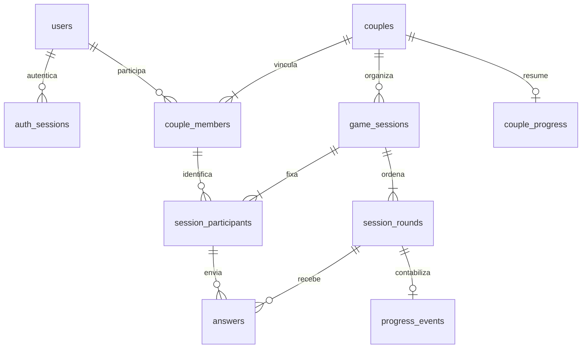

# Modelo de dados — Conectadois

Versão 1.0 · 04/09/2026 · Entrega da tarefa 34.

Este documento define o modelo lógico para PostgreSQL e as regras que deverão orientar as migrações e a API. O esquema relacional está em [modelo-de-dados.dbml](modelo-de-dados.dbml). A implementação atual continua usando JSON; este trabalho não migra dados nem altera o comportamento do app.

## Relacionamentos

O diagrama representa partidas iniciadas: cada partida tem exatamente dois participantes e ao menos uma rodada. As cardinalidades mínimas são regras transacionais, não apenas chaves estrangeiras.

## Convenções

- Identificadores UUID gerados no servidor, independentes de nome, e-mail e posição na interface.
- Instantes em `timestamptz`, armazenados em UTC; datas civis em `date`. O fuso IANA do casal é copiado para cada partida para calcular os dias de atividade sem ambiguidades posteriores.
- Campos obrigatórios são `not null` no DBML. Campos opcionais aceitam `null`, nunca string vazia como ausência de data.
- E-mails são aparados e normalizados para minúsculas antes de gravar. A unicidade também deve usar `lower(email)` no PostgreSQL.
- `created_at` é imutável. O serviço atualiza `updated_at` nas alterações. Senhas e tokens nunca integram os contratos públicos.
- Estados e combinações de campos descritos abaixo precisam de `CHECK`, índices parciais ou validação transacional nas futuras migrações. O DBML é uma especificação, não uma migração executável.

## Entidades e campos

### Usuários — `users`

Conta individual: `id`, `name`, `email`, `password_hash`, `email_verified_at`, `created_at`, `updated_at`, `deleted_at`.

Nome e e-mail não podem ser vazios. `password_hash` guarda algoritmo, salt e hash, compatíveis com a função de segurança existente. A conta pode existir sem casal. Não armazenar `couple_id` aqui: o vínculo é obtido de `couple_members`, evitando duas fontes de verdade. A exclusão lógica bloqueia novos acessos; não substitui a execução de uma solicitação de exclusão de dados.

### Casais — `couples`

Espaço compartilhado: `id`, `status`, `anniversary`, `timezone`, `invite_token_hash`, `invite_expires_at`, `created_at`, `paired_at`, `closed_at`.

Estados: `waiting` → `active` → `closed`; `waiting` também pode ir diretamente a `closed`. O criador ocupa a primeira vaga. A segunda entrada ativa o casal e consome o convite, limpando hash e validade. Convites precisam ser aleatórios, expiráveis e armazenados como hash. Reemissão invalida o convite anterior. Um casal encerrado não é reutilizado com outra pessoa.

### Vínculos — `couple_members`

Histórico de participação: `id`, `couple_id`, `user_id`, `slot` (1 ou 2), `joined_at`, `left_at`.

Índices únicos parciais em `user_id WHERE left_at IS NULL` e `(couple_id, slot) WHERE left_at IS NULL` garantem um casal vigente por usuário e no máximo duas vagas ocupadas por casal. `left_at >= joined_at`. O estado `active` exige as duas vagas ocupadas por pessoas distintas. Entradas concorrentes bloqueiam a linha de `couples` e validam convite, vagas e estado na mesma transação. A chave composta `(id, couple_id)` permite validar a origem dos participantes de uma partida.

### Sessões de autenticação — `auth_sessions`

Credencial de acesso: `id`, `user_id`, `token_hash`, `created_at`, `expires_at`, `last_seen_at`, `revoked_at`.

Um usuário pode ter vários dispositivos autenticados. O token original só é entregue ao cliente; o banco guarda seu hash único. `expires_at > created_at`. Expiração, revogação ou exclusão da conta tornam o acesso inválido. Logout revoga a sessão correspondente; troca de senha deve revogar as sessões conforme a política da tarefa 45. Esta entidade não representa uma partida.

### Partidas — `game_sessions`

Contexto de jogo: `id`, `couple_id`, `mode`, `status`, `timezone`, `created_at`, `started_at`, `ended_at`.

Modos: `questions`, `challenges`, `mixed`. Estados: `ready`, `active`, `completed`, `abandoned`. Criação inclui os dois participantes e as rodadas numa única transação. `ready` → `active` → `completed`; `ready` ou `active` → `abandoned`. Não reabrir partidas terminais. `ended_at` é obrigatório apenas nos estados terminais e não pode anteceder a criação/início. Completar exige todas as rodadas resolvidas ou puladas; uma partida toda pulada pode terminar, mas não gera progresso.

### Participantes — `session_participants`

Retrato do vínculo na partida: `session_id`, `couple_id`, `member_id`, `joined_at`. Chave primária `(session_id, member_id)`.

Chaves estrangeiras compostas verificam que sessão e vínculo pertencem ao mesmo casal. A partida sempre fixa dois vínculos distintos, vigentes na criação. A identidade da resposta vem da sessão autenticada, nunca de um nome informado pelo cliente. No jogo em um dispositivo, registros feitos pela mesma conta não comprovam a participação autenticada da outra pessoa; esse fluxo local não deve alimentar automaticamente respostas privadas ou progresso remoto.

### Rodadas — `session_rounds`

Atividade escolhida: `id`, `session_id`, `position`, `activity_key`, `content_version`, `theme_key`, `kind`, `prompt_snapshot`, `options_snapshot`, `status`, `revealed_at`, `resolved_at`.

Tipos: `open_text`, `multiple_choice`, `challenge`. Estados: `pending`, `resolved`, `skipped`. `position > 0` e única por partida. Chave composta `(id, session_id)` liga respostas e progresso à partida correta. O texto e as opções são cópias imutáveis do conteúdo selecionado; uma revisão editorial não muda uma pergunta já respondida. As opções contêm IDs estáveis e rótulos, e só existem em múltipla escolha. `activity_key` e versão permitem rastrear o banco editorial; a entidade de catálogo e suas revisões serão detalhadas na tarefa 52.

Uma partida pode selecionar um ou vários temas: os temas efetivamente jogados são derivados das rodadas. `questions` aceita `open_text` e `multiple_choice`; `challenges` aceita apenas `challenge`; `mixed` aceita os três tipos. `resolved_at` existe nos estados terminais. `revealed_at` só existe em rodada resolvida com duas participações válidas. Pular encerra a rodada sem revelar respostas já enviadas.

### Respostas e confirmações — `answers`

Participação por rodada: `id`, `session_id`, `round_id`, `member_id`, `kind`, `text_value`, `option_key`, `challenge_completed`, `submitted_at`, `updated_at`.

Unicidade `(round_id, member_id)` impede resposta duplicada; novas partidas podem repetir a mesma atividade sem sobrescrever o histórico. Chaves compostas exigem rodada e participante da mesma partida. `kind` deve coincidir com o tipo da rodada, validado no serviço transacional.

| Tipo | Valor obrigatório | Outros valores |
| --- | --- | --- |
| `open_text` | `text_value` aparado, entre 1 e 500 caracteres | Opção e confirmação nulas |
| `multiple_choice` | `option_key` presente nas opções da rodada | Texto e confirmação nulos |
| `challenge` | `challenge_completed = true`, confirmação individual | Texto e opção nulos |

Rascunhos ficam no cliente, não contam como participação. Pular não cria resposta fictícia. É permitido corrigir uma resposta antes da revelação; depois de resolvida ou pulada, a rodada é imutável. A API retorna apenas a própria resposta até existirem as duas participações válidas. Ao resolver a rodada, fixa `revealed_at` e `resolved_at` atomicamente. A consulta verifica o vínculo vigente e o casal da partida antes de retornar qualquer conteúdo.

### Histórico de progresso — `progress_events`

Fato confirmado pelo servidor: `id`, `couple_id`, `session_id`, `round_id`, `kind`, `occurred_at`, `activity_date`.

`kind`: `mutual_answer` ou `mutual_challenge`. Uma rodada gera no máximo um evento, garantido por unicidade em `round_id`. As chaves compostas amarram evento, casal, partida e rodada. Não incluir texto, alternativa escolhida ou detalhes íntimos no evento.

Só registrar quando os dois participantes confirmam uma rodada. A data civil é calculada pelo servidor a partir de `occurred_at` no fuso congelado da partida. Reenvio, releitura, correção e clique em concluir não criam novo evento. Respostas, resolução da rodada, evento e atualização do resumo são gravados na mesma transação. Analytics segue separado e não é a fonte oficial de progresso.

### Resumo — `couple_progress`

Projeção reconstruível: `couple_id` (PK), `completed_rounds`, `completed_challenges`, `last_activity_date`, `current_streak`, `longest_streak`, `updated_at`.

Contadores inteiros não negativos. `completed_challenges <= completed_rounds` e `current_streak <= longest_streak`. O histórico de eventos é a fonte de verdade; o resumo pode ser apagado e reconstruído a partir dele. Nunca aceitar contadores enviados pelo cliente.

- Primeiro dia com participação mútua: sequência 1.
- Outra rodada no mesmo dia: soma rodada, sem aumentar dias.
- Dia imediatamente seguinte: soma um dia à sequência.
- Lacuna de pelo menos um dia sem atividade: nova sequência 1.
- A leitura retorna sequência atual 0 se o último dia de atividade for anterior a ontem no fuso vigente do casal. O maior valor histórico permanece.
- Em mudanças de fuso, datas históricas não são reescritas; recalcular a projeção pelas datas distintas ordenadas dos eventos. Isso também trata eventos de partidas antigas finalizadas posteriormente.

Conquistas serão derivadas destes fatos na tarefa 55, com critérios versionados e concessão única por casal/conquista. Não inventar pontuação ou prêmios antes dessa definição de produto.

## Integridade, transações e acesso

1. Criar casal e primeiro vínculo juntos. Entrar valida convite sob bloqueio da linha do casal, ocupa vaga, ativa e consome convite numa transação.
2. Iniciar partida valida casal ativo e dois vínculos vigentes, congela participantes e conteúdo. Não criar partida compartilhada para casal incompleto.
3. Responder bloqueia a rodada, valida acesso, tipo, estado e payload, faz inserção/atualização pela chave única. A segunda participação resolve e contabiliza uma única vez; bloqueio do casal serializa a reconstrução do resumo.
4. Pular disputa o mesmo bloqueio da resposta. Se a rodada já foi resolvida, não pode ser pulada. Se já foi pulada, novas respostas são recusadas.
5. Encerrar vínculo bloqueia o casal, encerra ambos os vínculos vigentes e abandona partidas abertas. Toda operação de jogo segue a mesma ordem de bloqueios: casal, partida, rodada. O ex-parceiro não acessa o histórico pelo endpoint compartilhado. Um novo casal começa sem herdar respostas ou progresso do anterior.
6. Sessão de login válida não basta para autorizar conteúdo de casal: todas as leituras e escritas validam pertencimento. Administração e analytics acessam agregados, sem conteúdo das respostas.
7. Chaves estrangeiras usam `RESTRICT` por padrão. Exclusão de conta/casal requer fluxo explícito que trate respostas, vínculos, credenciais, eventos e projeções na ordem adequada. Prazos de retenção, exportação e tratamento de dados compartilhados pertencem às tarefas 37 e 50; não assumir que soft delete cumpre exclusão definitiva.

## Índices necessários

Além das PKs, unicidades e FKs do DBML: e-mail normalizado; hashes de sessão e convite; sessões por usuário/expiração; índices parciais de vínculo vigente descritos acima; partidas por casal/data; respostas por participante/partida; eventos por casal/data; rodadas por partida/posição. As futuras migrações devem criar índices nos lados das FKs usados em exclusão e consulta. Evitar indexar conteúdo íntimo.

## Mapeamento da implementação atual

| Origem atual | Destino | Tratamento |
| --- | --- | --- |
| `users` do JSON | `users` | Preservar UUID e hash de senha, normalizar e verificar duplicidade de e-mail |
| `users.coupleId` e `couples.members` | `couple_members` | Conciliar as duas fontes e rejeitar divergências para revisão, sem escolher silenciosamente uma delas |
| `couples` | `couples` | Preservar UUID/datas válidas, converter aniversário vazio em null, atribuir fuso explicitamente |
| `couples.code` | Convite novo | Invalidar código antigo e emitir convite com validade na migração |
| `sessions` do JSON | `auth_sessions` | Representa login; preferir invalidar acessos antigos e exigir novo login, evitando transportar tokens em texto |
| `answers.questionId` | Rodada de importação | Não há partida, versão ou data confiáveis; agrupar por casal/pergunta apenas para preservar respostas, sinalizar origem em `content_version = legacy` e não inventar timestamps de participação |
| `analyticsEvents` | Analytics separado | Não converter automaticamente em respostas, partidas ou progresso confirmado |
| `GamePage` em memória | Sem migração automática | Respostas locais não persistem e não comprovam autoria da segunda conta |
| Streak no `localStorage` | Sem importação | Valor atual pode ser incrementado por cliques; reconstruir apenas com fatos confirmados no servidor |

Respostas legadas precisam de uma tabela de staging na migração: o modelo final exige datas e participantes confiáveis. Preservar os registros originais em backup de acesso restrito, tratar inconsistências e definir aceite antes de promover dados ao modelo final. Não fabricar histórico de partidas ou sequências para preencher campos obrigatórios.

## Critérios para implementar e testar nas próximas tarefas

| Cenário | Resultado esperado |
| --- | --- |
| Duas entradas simultâneas na última vaga | Uma entrada aceita, outra recusada |
| Usuário tenta manter dois vínculos vigentes | Unicidade rejeita |
| Resposta referenciando rodada de outra partida/casal | FK ou autorização rejeita |
| Primeira resposta enviada | Parceiro não recebe seu conteúdo |
| Segunda resposta e reenvio concorrentes | Uma resolução e um evento de progresso |
| Desafio confirmado por apenas um participante | Sem progresso mútuo |
| Texto vazio, opção inexistente ou payload de outro tipo | Escrita recusada |
| Mesma pergunta em duas partidas | Histórico independente |
| Pular após só uma resposta | Nenhuma revelação nem progresso |
| Várias rodadas no mesmo dia / virada de dia | Um dia de sequência / cálculo no fuso da partida |
| Projeção removida e reconstruída | Mesmos totais e sequências |
| Encerramento do casal concorrente com resposta | Nenhuma escrita após fechamento, sem acesso compartilhado posterior |

A modelagem conclui a tarefa 34. Provisionamento e migrações, contrato da API, conteúdo, persistência de partidas, privacidade de respostas e progresso continuam sujeitos às tarefas 41, 35, 52, 111, 53, 54 e 55. O DBML foi verificado estruturalmente; restrições e concorrência deverão ser testadas no PostgreSQL quando essas implementações existirem.
