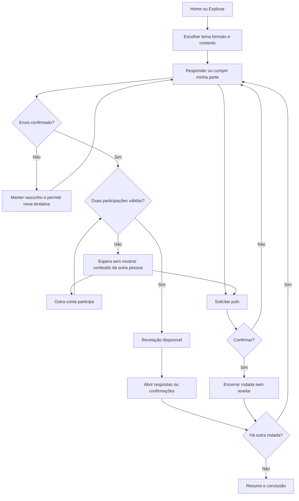

# Perguntas e revelação mútua — Conectadois

Versão 1.0 · 04/09/2026 · Tarefa 25.

Desenho funcional e protótipo navegável prontos para revisão. O aceite de “fluxo validado” depende dos testes com casais da tarefa 30. Este material complementa [a home](HOME-E-ROTINA-DIARIA.md) e respeita [o modelo de dados](MODELO-DE-DADOS.md); não implementa as APIs ou altera o jogo atual.

**Abrir:** [protótipo de perguntas e revelação](prototipo-perguntas-revelacao.html). Funciona como arquivo local, com JavaScript habilitado, sem servidor, instalação ou envio de dados. As pessoas Ana e Alex e todas as confirmações são simuladas. O seletor de pessoa pertence à barra de revisão, não ao produto remoto real. Recarregar apaga a demonstração.

## Objetivo e limites

Cada pessoa deve entender o que vai fazer, responder sem ver a participação da outra, acompanhar o momento e descobrir as duas respostas após a confirmação bilateral. Desafios usam confirmação individual da realização. Não há resposta certa, nota de compatibilidade ou recompensa por pressionar a outra pessoa.

O plano atual permanece preservado. Este desenho cobre resposta guardada, múltipla escolha com revelação das duas respostas, discursivas e desafios. Adivinhação e revelação apenas de coincidências têm regras próprias e continuam nos itens 113 e 114; não são consideradas implementadas por este fluxo.

## Entrada e configuração — PR-01

Entradas: ação contextual da home, catálogo Explorar ou retomada de partida em Nós. Uma pendência abre na rodada existente, sem recriar partida. Uma nova experiência passa pela configuração:

| Controle | Comportamento |
| --- | --- |
| Tema | Seleção explícita entre os 11 temas atuais; Descontraído como sugestão inicial |
| Formato | Perguntas, Desafios ou Misto |
| Resposta das perguntas | Discursiva ou Múltipla escolha; oculto no modo apenas Desafios |
| Contexto | Cada um na própria conta ou Juntos neste dispositivo |
| Resumo | Tema, formato, intensidade, tempo estimado e quantidade de atividades antes de começar |
| Ação | “Começar momento”; alternativa “Voltar à home” |

O protótipo contém uma rodada por formato e duas no modo misto: pergunta seguida de desafio. O produto utilizará a quantidade, duração e intensidade reais do lote aprovado; o desenho não fixa o tamanho de todas as partidas. Os exemplos do protótipo são ilustrativos, não ampliam nem aprovam o banco editorial. A escolha de tema íntimo não autoriza sua publicação no piloto sem revisão.

Depois de começar, tema, formato, contexto e conteúdo ficam congelados. Trocar essas escolhas exige encerrar a partida e iniciar outra; não perder uma resposta ao trocar um filtro. O protótipo usa “Recomeçar demonstração”, com confirmação, exclusivamente como ferramenta de revisão.

## Telas e microtextos

| ID | Estado | Conteúdo e ação |
| --- | --- | --- |
| PR-02 | Minha resposta discursiva | Pergunta, nome da conta, campo “Sua resposta”, contador 0/500 e “Guardar minha resposta” |
| PR-03 | Minha escolha | Pergunta, opções com rótulos e seleção única; “Guardar minha escolha” |
| PR-04 | Meu desafio | Ação, orientação para combinar limites e “Cumpri minha parte” |
| PR-05 | Enviando | Botão desabilitado, “Guardando…”; impedir envio repetido |
| PR-06 | Falha de envio | “Não conseguimos guardar sua participação”; manter rascunho, não informar sucesso; tentar novamente |
| PR-07 | Minha parte enviada | “Sua parte está guardada”; participação própria e status neutro do parceiro; “Corrigir minha resposta” enquanto a rodada não estiver resolvida |
| PR-08 | Outra pessoa participando | Na conta dela, mostrar apenas a pergunta e seu campo; nenhuma prévia do texto/opção da primeira pessoa |
| PR-09 | Revelação disponível | “As duas participações estão prontas”; “Revelar respostas” ou “Ver confirmações” |
| PR-10 | Revelação aberta | Dois cartões com nomes e participações; “Leiam com calma. Depois contem o que mais chamou atenção.” |
| PR-11 | Pular | Confirmação explica: “Esta atividade será encerrada para os dois sem revelar respostas.”; cancelar ou “Pular para os dois” |
| PR-12 | Atividade pulada | Mensagem neutra, sem indicar culpado; “Continuar” |
| PR-13 | Pausa | “Seu momento pode continuar depois”; retomar a mesma rodada e conta |
| PR-14 | Conclusão | Quantidade de atividades com participação dos dois e puladas, sem pontos; se nenhuma concluída: “Momento encerrado” |
| PR-15 | Acesso expirado/vínculo encerrado | Ocultar perguntas e respostas; revalidar acesso ou voltar ao pareamento; nunca mostrar dados de outro vínculo |

Na partida local, PR-07 oferece “Passar o dispositivo” antes de apresentar a tela da outra pessoa. O nome da vez fica destacado, e a resposta anterior não aparece durante a passagem. Esse fluxo evita exposição casual na interface, mas não garante sigilo entre pessoas que compartilham um dispositivo. Não atribuir autoria remota ou progresso confirmado a uma segunda conta com base nessa passagem.

## Fluxo principal

Cancelar o pulo retorna exatamente ao estado de origem, inclusive espera ou edição, preservando o rascunho. O diagrama resume as transições; a tabela e as regras abaixo prevalecem para estados concorrentes.

## Regras de resposta e revelação

1. Discursiva: 1 a 500 caracteres após remover espaços externos. Texto vazio não habilita envio. Renderizar como texto, nunca HTML.
2. Múltipla escolha: exatamente uma opção válida. Não destacar alternativa supostamente correta. Confirmar antes de enviar; tocar numa opção sozinho não submete.
3. Desafio: cada pessoa confirma a própria parte. Sem fotos comprobatórias, prazo coercitivo ou botão para marcar pelo parceiro. Pular é sempre uma opção antes da resolução.
4. Rascunho não é resposta. Na API futura, identidade vem da autenticação; cliente não escolhe `user_id` da outra pessoa.
5. Antes das duas confirmações válidas, a consulta retorna apenas conteúdo próprio e o estado de participação da outra pessoa. O botão de revelação não existe nessa fase.
6. Após a segunda confirmação, a rodada é resolvida no servidor e ambas as respostas tornam-se elegíveis para leitura. A ação “Revelar” abre a apresentação na interface; não é uma terceira autorização nem exige clique simultâneo dos dois.
7. Correção é permitida enquanto a rodada está pendente. Se a outra pessoa confirmar durante uma edição, a versão já enviada é resolvida e o novo envio é recusado; mostrar aviso e oferecer abrir a revelação. Nunca sobrescrever uma rodada já resolvida.
8. Pular é uma decisão individual que encerra a rodada compartilhada sem revelação e sem progresso. Não exigir permissão do parceiro. A confirmação explica a consequência; se a rodada já foi resolvida por outro envio, prevalece o estado do servidor e o pulo é recusado.
9. Reenvios e releituras não criam novas respostas, rodadas ou progresso. Concluir a tela também não concede pontos.
10. Na revelação de múltipla escolha, mostrar as duas escolhas, iguais ou diferentes. A mecânica “somente coincidências” não está embutida aqui.

## Retomada, rede e saída

“Sair por agora” pausa a navegação, sem encerrar a partida. Na implementação, respostas confirmadas são recuperadas da API; rascunhos não enviados ficam apenas em memória e podem se perder ao fechar a aba. Informar isso antes da saída quando houver rascunho. Não persistir conteúdo íntimo em cache público ou localStorage para dar aparência de recuperação.

Sem conexão, a pessoa pode editar seu rascunho, mas enviar, corrigir, pular e avançar estado compartilhado ficam indisponíveis. Ao reconectar, consultar o estado antes de repetir uma operação. Se o servidor já confirmou o envio anterior, recuperar a confirmação em vez de duplicá-la.

Login expirado oculta conteúdo e pede autenticação; após autenticar, revalidar vínculo e rodada. Desvinculação abandona a partida e retira o acesso compartilhado. A barra de revisão do protótipo permite simular offline, falha no próximo envio, acesso expirado e vínculo encerrado. Essas simulações não substituem testes da API.

No protótipo, pausa e rascunho só sobrevivem dentro da mesma página aberta. Alterar a pessoa na barra de revisão mostra sua visão individual; isso é ferramenta de avaliação, não autorização real. Não digitar informações íntimas para revisar uma demonstração que contém as duas perspectivas em memória.

## Layout, conteúdo e acessibilidade

Uma coluna principal de leitura, com resumo contextual discreto ao lado no desktop. No celular: voltar/pausar, tema e rodada, pergunta ou desafio, participação, ação principal e pulo. Sem navegação fixa disputando espaço com teclado aberto na tela de resposta. A revelação usa dois cartões empilhados no celular.

Identidade ameixa/creme com dourado decorativo, títulos editoriais e controles com no mínimo 44 px. Campo rotulado, opções agrupadas por legenda, erros anunciados e foco visível. Transições de tela levam foco ao título; digitar não recria o campo. Nomes e respostas longos quebram linha. Aceitar teclado, zoom e redução de movimento. Nenhuma animação é necessária para revelar.

Texto de status usa “Sua parte está guardada” em vez de cobrar quem falta. Conteúdo íntimo não vai para a home nem notificações. Erros operacionais não exibem tokens, IDs, stack traces ou detalhes internos. A mensagem após pulo não identifica quem pulou.

## Mapeamento para execução

| Entrega futura | Itens do plano |
| --- | --- |
| Protótipo e validação com casais | 25, 27, 29, 30 |
| Catálogo com opções, tema, intensidade e duração | 52, 77, 115 |
| Partida e rodadas imutáveis | 111 |
| Autoria, envio e revelação bilateral | 53, 54, 67, 68, 116 |
| Progresso derivado de rodadas resolvidas | 55 |
| Falhas, acessibilidade e dispositivos | 73, 74, 75 |
| Integração e isolamento entre contas | 81, 82, 84 |

Este desenho não muda o escopo do piloto e não depende de executar a reconciliação 112 para ser revisado. Os formatos já solicitados são preservados.

## Roteiro de verificação

- Discursiva: Ana envia; Alex não consegue ver seu texto antes de enviar; revelar e concluir.
- Múltipla escolha: seleção sem confirmação não conta; cada pessoa escolhe; comparar sem acerto/erro.
- Desafio: uma confirmação não libera conclusão; duas confirmações liberam; pular não conta.
- Misto: pergunta seguida de desafio; resumo diferencia resolvidas e puladas.
- Correção: alterar antes da segunda resposta; edição recusada após resolução.
- Pulo: cancelar preserva rascunho; confirmar oculta respostas já enviadas; ambas as pessoas veem estado neutro.
- Rede: falha mantém rascunho e não marca envio; offline bloqueia mutações; retomar não duplica participação.
- Pausa: sair e retomar a mesma rodada; a outra visão não recebe o rascunho.
- Segurança de interface: nomes/entradas como texto, acesso expirado sem conteúdo e vínculo encerrado sem retomada.

O validador `scripts/validate-revelation-prototype.mjs` verifica as regras de estado e as projeções de privacidade com dados fictícios, sem dependências externas. Validação visual em navegador, tecnologias assistivas e sessões com casais permanece pendente; o protótipo não demonstra segurança real de backend.
