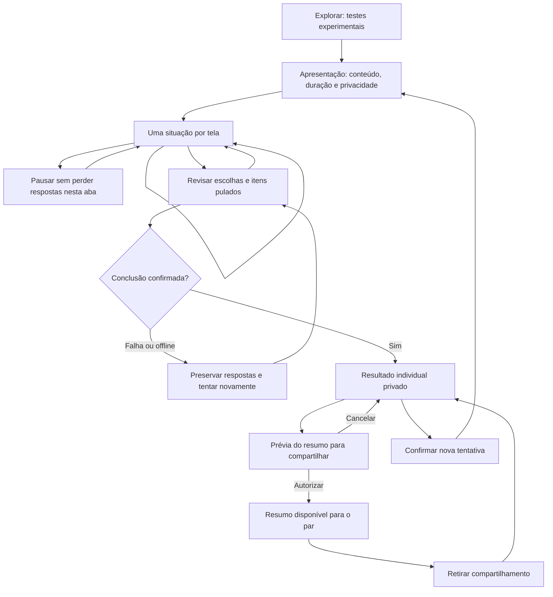

# Testes e resultados — Conectadois

Versão 1.0 · 05/09/2026 · Tarefa 26.

Desenho funcional e protótipo navegável para revisão. O entregável “Fluxo validado” permanece em andamento até revisão visual e validação com casais na tarefa 30. Complementa a [arquitetura de informação](ARQUITETURA-DE-INFORMACAO.md), a [home](HOME-E-ROTINA-DIARIA.md) e o [escopo do MVP, seção 6](ESCOPO-MVP.md).

**Abrir:** [protótipo de testes e resultados](prototipo-testes-resultados.html). Funciona como arquivo local ou pelo servidor da demo, sem cadastro. Ana e Alex são personagens fictícias. Dados ficam somente em memória e são apagados ao recarregar. A troca de pessoa e a simulação de rede são ferramentas de revisão. Não há integração com contas, backend ou histórico real.

## Objetivo e escopo

Dar espaço para cada pessoa refletir sobre suas preferências, ler suas próprias respostas e escolher se deseja compartilhar um resumo com o par. O resultado inicia uma conversa, sem pontuar a relação ou classificar a pessoa de forma definitiva.

Dois percursos usam a mesma estrutura:

- **Formas de afeto:** cinco situações ilustrativas sobre palavras, tempo, gestos, ajuda e contato físico consentido. Usa nome descritivo, conforme o escopo experimental do MVP.
- **Temperamentos:** quatro situações ilustrativas sobre iniciativa, expressão, tranquilidade e reflexão. O resultado conserva os termos tradicionais apenas como referências do conteúdo, sem afirmar “você é” determinado tipo.

As perguntas são originais e candidatas para revisão. Quantidade e tempo estimado se referem apenas a esta demonstração. Não constituem questionário validado, instrumento psicológico ou modelo de pontuação aprovado. Revisões editorial e especializada continuam nas tarefas 76 e 77; a revisão jurídica prevista no escopo permanece requisito de publicação. Temperamentos não entra no piloto sem a revisão prevista. Nenhum destes módulos bloqueia a conclusão do MVP.

### Evolução orientada por feedback qualitativo

O feedback registrado em [Feedback de produto — 21/09/2026](FEEDBACK-DE-PRODUTO-2026-09-21.md) propõe valor adicional depois que as duas pessoas concluem Formas de afeto: um “match” do casal, sugestões práticas e lembretes semanais. O termo “match” descreve a junção consentida de dois resumos, não compatibilidade ou avaliação do relacionamento.

Essa evolução deve preservar o resultado individual atual e acrescentar um fluxo separado:

1. cada pessoa conclui a mesma versão e mantém seu resultado privado;
2. cada uma autoriza explicitamente o resumo que pode compor a visão bilateral;
3. o sistema apresenta forças compartilhadas, formas complementares e oportunidades de cuidado;
4. cada pessoa recebe sugestões pequenas e revisadas do que pode experimentar pela outra;
5. cada participante decide individualmente se deseja um lembrete semanal neutro.

Se só uma pessoa concluir, compartilhar ou mantiver a autorização, não existe visão bilateral. Revogação, nova versão incompatível ou desvinculação encerram seu acesso e cancelam lembretes derivados. O protótipo atual não implementa esse fluxo.

## Entradas e navegação

Entrada por Explorar → Testes experimentais; a home pode oferecer um cartão contextual. Retomada pela mesma área. No produto futuro, Nós reúne os resultados próprios e resumos autorizados do vínculo atual. Meu resultado nunca depende de a outra pessoa responder. Compartilhar exige vínculo ativo, conclusão individual e confirmação explícita por teste e versão. Ler o resumo autorizado do par não exige fazer o mesmo teste.

## Telas, estados e microtextos

| ID | Tela/estado | Conteúdo e ações |
| --- | --- | --- |
| TR-01 | Catálogo | “Um pouco mais sobre você”; dois cartões, selo Experimental, quantidade e estimativa. Retomar ou abrir resultado quando houver. |
| TR-02 | Apresentação | Propósito, conteúdo ilustrativo, privacidade e “Começar reflexão”. Explica pulo, ausência de certo/errado e resultado individual. |
| TR-03 | Pergunta | Uma situação, posição no percurso, cinco opções de “Não me representa agora” a “Me representa muito”, seleção única e “Continuar” separado da escolha. |
| TR-04 | Pulo | “Prefiro não responder”; registra ausência de resposta, nunca zero. Pode voltar e responder depois. |
| TR-05 | Pausa | “Podemos continuar depois”; respostas preservadas nesta aba. Retomar ou voltar ao catálogo. Fechar/recarregar a demonstração apaga os dados. |
| TR-06 | Revisão | Todas as situações, escolhas e pulos com ação “Editar”. “Ver meu resultado” conclui apenas com pelo menos uma resposta. |
| TR-07 | Sem respostas | “Responda pelo menos uma situação para ver seu resumo”; voltar para responder, sem inventar resultado. |
| TR-08 | Concluindo | “Preparando seu resumo…”; impedir cliques duplicados. |
| TR-09 | Falha/offline | Explicar que a conclusão não foi confirmada; manter revisão e escolhas, permitir nova tentativa. |
| TR-10 | Resultado privado | Data, versão, quantidade respondida, todas as dimensões e respectivas escolhas; itens pulados como “Não respondido”. Sem percentuais de personalidade. |
| TR-11 | Resultado parcial/empate | Selo Parcial quando houve pulo. Mostrar todos os destaques empatados sem desempate arbitrário. Se todas as respostas forem baixas, não eleger um perfil predominante. |
| TR-12 | Prévia de compartilhamento | Conteúdo exato do resumo e destinatário. Não inclui perguntas nem escolhas individuais. “Compartilhar resumo com Alex” exige clique explícito. |
| TR-13 | Compartilhado | Identificar destinatário e oferecer “Retirar compartilhamento”. Não sugerir publicação externa. |
| TR-14 | Visão do par | Catálogo mostra apenas resumo autorizado. Ausência de resumo usa texto neutro; não expor início, pausa, escolhas ou recusa. |
| TR-15 | Refazer | Explicar que, neste protótipo, nova tentativa substitui a anterior e retira o resumo compartilhado. Cancelar preserva tudo. |
| TR-16 | Acesso expirado/vínculo encerrado | Ocultar conteúdo na sessão expirada; após login revalidar acesso. Desvinculação retira resumos compartilhados, preservando acesso ao resultado próprio. |

## Composição visual

Layout mobile-first: uma coluna no celular, conteúdo principal e apoio lateral no desktop. Fundo creme, cartões claros, títulos ameixa, detalhes dourados e verdes conforme a identidade existente. Tipografia local Georgia/Arial como fallback, sem carregar serviços externos. Cabeçalho com wordmark e caminho de volta; navegação principal permanece visível como contexto no catálogo.

Pergunta: nome do percurso → progresso → título → instrução → opções grandes → continuar → pular/pausar. Resultado: selo de privacidade → título acolhedor → resumo do momento → lista de dimensões → convite à conversa → compartilhar → refazer. Barras representam a escolha de 1 a 5, sempre com texto equivalente; não são percentuais ou comparação entre pessoas.

## Regras de resultado

1. Cada situação tem uma dimensão e uma resposta inteira de 1 a 5. Selecionar não avança automaticamente. Voltar preserva a seleção; editar retorna à revisão.
2. Pular define resposta ausente. Resultado requer uma ou mais respostas. “Parcial” informa quantas ficaram sem resposta.
3. Nesta demonstração, cada dimensão tem uma situação. A barra mostra a escolha diretamente, sem inferência estatística ou normalização.
4. Destaques são todas as dimensões com o maior valor observado, apenas se esse valor for 4 ou 5. Empates são apresentados juntos. Valores até 3 geram “Suas escolhas não destacaram uma preferência forte agora”. Ausência não participa do cálculo.
5. Perguntas, dimensões, escala e cálculo precisam ser revistos em conjunto antes do serviço definitivo. Não estender esta regra para um banco maior sem revisão e versionamento.
6. O resultado se refere às escolhas daquele momento. Não usar “seu parceiro precisa”, previsão de comportamento, diagnóstico, ranking ou nota de compatibilidade. No resultado individual, o convite “O que destas escolhas faz sentido para você hoje?” permanece igual para todos. Sugestões personalizadas só entram na evolução bilateral consentida, a partir de conteúdo versionado e revisado, com linguagem de convite e possibilidade de adaptar ou ignorar.
7. Nova tentativa não incrementa streak ou progresso bilateral. O protótipo substitui a anterior após confirmação; política de histórico real deve ser definida nas tarefas 56/57 antes da integração.

### Mapeamento da implementação binária atual

A planilha [mapeamento-linguagens-do-amor.xlsx](../Conteúdo/mapeamento-linguagens-do-amor.xlsx) registra as 32 combinações possíveis das cinco perguntas A/B atualmente implementadas em `src/App.tsx`, incluindo linguagem por alternativa, pontuação, empates e resultado exibido. O arquivo é reproduzível por `scripts/build-love-language-mapping.ps1` e validado por `scripts/validate-love-language-mapping.ps1`.

Esse mapeamento evidenciou uma divergência a resolver: a implementação atual desempata escolhendo a primeira linguagem empatada encontrada na ordem Q1 a Q5, enquanto o desenho TR-11 orienta mostrar todos os destaques empatados sem desempate arbitrário. A planilha documenta o comportamento existente; não o promove como regra editorial aprovada.

## Privacidade, acesso e sincronização

Por padrão, questionário e resultado são individuais. Compartilhamento autoriza somente o resumo mostrado na prévia: nome do percurso, data, indicação de parcial/completo, destaques (ou ausência deles) e aviso de conteúdo experimental. Não autoriza respostas brutas. Revogar interrompe leituras futuras; não promete apagar algo já visto pela outra pessoa.

No produto, identidade deve vir da sessão autenticada. Autorizar/revogar deve ser uma operação confirmada pelo servidor e vinculada ao casal e à versão do resultado. Desvincular remove a autorização anterior, que não migra para um novo vínculo. A API deve omitir resultados não autorizados, em vez de confiar em ocultação por CSS. A troca de personagem no protótipo não equivale a isolamento real de segurança.

Offline permite navegar e editar na memória da aba. Conclusão, compartilhamento e revogação exigem confirmação online; falha não exibe sucesso. Em produção, recarregar consulta respostas confirmadas no servidor; rascunhos não enviados exigem aviso de possível perda, sem armazenar conteúdo íntimo em cache público. Reenvio de conclusão deve ser idempotente por tentativa; concorrência entre refazer, compartilhar e desvincular deve respeitar versão e vínculo ativos.

## Acessibilidade e responsividade

Usar fieldset/legend e radios nativos, ordem lógica de teclado, foco visível e título focado após troca de tela. Botões com alvo mínimo de 44 px; seleção indicada por borda, controle e texto, além da cor. Progresso nomeado, erros com anúncio acessível, nenhum avanço automático ou limite de tempo. Revisar a 320, 390, 768 e 1440 px, zoom de 200%, teclado e leitor de tela nas tarefas 74/75 e 30. O desenho não equivale a uma auditoria concluída.

## Critérios e roteiro de validação

| Caso | Ação | Resultado esperado |
| --- | --- | --- |
| A | Concluir cada percurso | Todas as escolhas aparecem no resultado próprio; nenhum resumo é publicado automaticamente. |
| B | Selecionar, voltar e editar na revisão | Escolhas persistem; resultado reflete a edição; selecionar sozinho não avança. |
| C | Pular tudo / pular parte | Tudo pulado bloqueia conclusão; parte pulada informa parcial e não inventa valores. |
| D | Respostas iguais altas / iguais baixas | Todos os maiores valores altos empatam; valores baixos não geram perfil predominante. |
| E | Pausar e retomar | Retoma mesma situação e escolhas na aba; catálogo não expõe pendência ao par. |
| F | Falha de conclusão e offline | Sem resultado confirmado; revisão preservada e nova tentativa disponível. |
| G | Prévia, cancelar, autorizar e revogar | Cancelar mantém privado; só o resumo consentido aparece para o par; revogar o retira. |
| H | Refazer/cancelar | Cancelar preserva resultado e autorização; confirmar zera tentativa e retira resumo anterior. |
| I | Expirar acesso / encerrar vínculo | Acesso expirado oculta dados; vínculo encerrado remove resumos compartilhados. |
| J | Teclado, celular e zoom | Conteúdo legível sem corte horizontal; foco acompanha telas e controles são operáveis. |

Na tarefa 30, pedir a cada pessoa que encontre o teste, explique a privacidade, responda/pule, pause, edite, interprete um empate e compartilhe/revogue o resumo. Perguntar: “Isto diz algo definitivo sobre você?” e “O que a outra pessoa pode ver?”. Registrar conclusão sem ajuda, dúvidas, erros e compreensão dos limites. Nenhuma sessão com usuários foi realizada nesta entrega.

## Integração e acompanhamento

Tarefa 26: desenho-base disponível, validação pendente. Tarefas 27 e 29: cobertura adicional de telas e protótipo. Tarefas 56 e 69: implementar e apresentar o resultado individual e a evolução bilateral consentida. Tarefas 58 e 72: preferências e lembretes opt-in. Tarefas 76/77: revisar conteúdo, cálculo e sugestões. A tarefa 143 integra essas partes na iteração posterior ao primeiro piloto e é obrigatória antes da UAT e do lançamento. Os testes atuais de `src/App.tsx` continuam sendo a implementação anterior. A tarefa 30 segue pendente.

Verificação técnica: `node scripts/validate-tests-prototype.mjs` exercita conclusão, pulos, empates, edição, retomada, falha, compartilhamento e revogação no modelo da demonstração. Não substitui teste em navegador, de API ou com casais.
